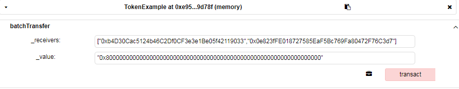
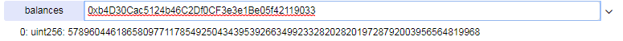
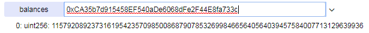
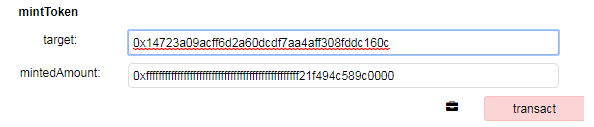
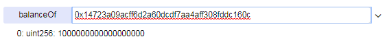

###  整型溢出

以太坊虚拟机（EVM）为整数指定固定大小的数据类型。这意味着一个整型变量只能有一定范围的数字表示。例如，一个 `uint8` ，只能存储在范围 [0,255] 的数字。试图存储 256 到一个 `uint8` 将变成 0。不加注意的话，只要没有检查用户输入又执行计算，导致数字超出存储它们的数据类型允许的范围，Solidity 中的变量就可以被用来组织攻击。 

#### 乘法溢出

* 案例([CVE-2018-10299](https://nvd.nist.gov/vuln/detail/CVE-2018-10299))

```solidity
pragma solidity ^0.4.22;

library SafeMath {
    function sub(uint256 a, uint256 b) internal pure returns (uint256) {
        assert(b <= a);
        return a - b;
    }
    function add(uint256 a, uint256 b) internal pure returns (uint256 c) {
       c = a + b;
      assert(c >= a);
      return c;
    }    
}

contract TokenExample {
    using SafeMath for uint256;
    
    mapping(address => uint256) public balances;
    
    event Transfer(address _from,address _to,uint256 _value);
    
    function batchTransfer(address[] _receivers, uint256 _value) public returns (bool) {
      uint cnt = _receivers.length;
      uint256 amount = uint256(cnt) * _value;
      require(cnt > 0 && cnt <= 20);
      require(_value > 0 && balances[msg.sender] >= amount);
    
      balances[msg.sender] = balances[msg.sender].sub(amount);
      for (uint i = 0; i < cnt; i++) {
          balances[_receivers[i]] = balances[_receivers[i]].add(_value);
          emit Transfer(msg.sender, _receivers[i], _value);
      }
      return true;
    }
}
```

上述合约代码中，存在漏洞的代码为```uint256 amount = uint256(cnt) * _value;```，计算转出总额度amount未使用SafeMath也未对溢出进行检查，直接将转账地址数量乘以转账额度，如果输入极大的```_value```，那么amount计算结果就可能产生溢出，导致代币增发。

在Remix-ide中测试如下：

1、部署合约；

2、调用batchTransfer函数,向batchTransfer函数传入地址数组```["0xb4D30Cac5124b46C2Df0CF3e3e1Be05f42119033","0x0e823fFE018727585EaF5Bc769Fa80472F76C3d7"]```，以及_value``` "0x8000000000000000000000000000000000000000000000000000000000000000"  ```即2**255，使得amount=2\*\*255 * 2,超出uint256类型的范围[0,2\*\*256-1]，溢出为0，发送者账户余额不减少，并且，本例中，发送者的代币可以为零，实现"无中生有"。：



3、查看余额：



#### 减法溢出

* 案例

```js
pragma solidity ^0.4.22;

contract TokenExample {
    address public owner;
    mapping(address => uint256) public balances;
    mapping(address=>mapping(address=>uint256)) public allowed;
    
    event Transfer(address _from,address _to,uint256 _value);
    
    modifier onlyOwner {
        require(msg.sender == owner);
        _;
    }
    
    constructor() public {
    	owner = msg.sender; 
        balances[owner] = 2000 * 10**8;
    }
    
    function distribute(address[] addresses) public onlyOwner {
        for (uint i = 0; i < addresses.length; i++) {
             balances[owner] -= 2000 * 10**8;
             balances[addresses[i]] += 2000 * 10**8;
             emit Transfer(owner, addresses[i], 2000 * 10**8);
         }
    }
}
```

上述合约代码中，distribute函数的功能是从owner账户向指定的地址列表转入2000 * 10**8代币，但是在对```balances[owner]```的计算中未使用SafeMath，也未判断owner账户是否有足够的代币，当转出代币总量大于owner账户余额的时候，```balances[owner]```产生减法溢出，变成一个极大值。

在Remix-ide中测试如下：

1、部署合约

2、调用distribute函数，传入地址数组：

["0x14723a09acff6d2a60dcdf7aa4aff308fddc160c","0x4b0897b0513fdc7c541b6d9d7e929c4e5364d2db"]

owner分别向这两个地址发送2000 * 10**8代币，超过owner余额，```balances[owner]```产生减法溢出；

3、查询owner账户余额，等于2\*\*256-2000\*10\*\*8：



#### 加法溢出

* 案例

```solidity
pragma solidity ^0.4.22;

contract TokenExample {
    address public owner;
    mapping(address => uint256) public balanceOf;
    uint256 public totalSupply;
    uint8 public decimals = 18;
    
    event Transfer(address _from,address _to,uint256 _value);
    
    modifier onlyOwner {
        require(msg.sender == owner);
        _;
    }
    
    constructor() public {
    	owner = msg.sender; 
        totalSupply = 2000 * 10**uint256(decimals);
        balanceOf[owner] =  totalSupply;
    }
    
    function transfer(address _to, uint256 _value) public returns (bool success) {
        require(balanceOf[msg.sender] >= _value);
        require(balanceOf[_to] + _value >= balanceOf[_to]);
        balanceOf[msg.sender] -= _value;
        balanceOf[_to] += _value;
        emit Transfer(msg.sender, _to, _value);
        return true;
    }
    
    function mintToken(address target, uint256 mintedAmount) public onlyOwner {
        balanceOf[target] += mintedAmount;
        totalSupply += mintedAmount;
        emit Transfer(0, this, mintedAmount);
        emit Transfer(this, target, mintedAmount);
    }
}
```

上述合约代码中，mintToken函数的功能是owner向指定账户增发mintedAmount数量的代币，但是在对balanceOf[target]与totalSupply进行加法操作未做溢出检查，导致其可能存在溢出，并且，通过溢出，恶意owner可以任意增减target账户的余额，或者增发实际远远超过totalSupply的代币。

在Remix-ide中测试如下：

1、部署合约；

2、向target预先转一部分代币，模拟目标账户中已有的代币：调用transfer函数，传入地址target地址：

0x14723a09acff6d2a60dcdf7aa4aff308fddc160c，以及转账额度，比如2000000000000000000（2 * 10**uint256(decimals)）;

3、如果owner想控制target的余额减半，那么，他只需要向target增发2**256-balanceOf[target]+10\*\*18=0xfffffffffffffffffffffffffffffffffffffffffffffffff21f494c589c0000，现在调用mintToken函数，向target地址转入上述数量的代币：



4、查询target余额：



#### 漏洞修复

OpenZeppelin提供了一套很好的[SafeMath库](https://github.com/OpenZeppelin/openzeppelin-solidity/blob/master/contracts/math/SafeMath.sol)，使用SafeMath库函数能够有效避免溢出漏洞，SafeMath库源码如下：

```solidity
pragma solidity ^0.4.24;


/**
 * @title SafeMath
 * @dev Math operations with safety checks that throw on error
 */
library SafeMath {

  /**
  * @dev Multiplies two numbers, throws on overflow.
  */
  function mul(uint256 a, uint256 b) internal pure returns (uint256 c) {
    // Gas optimization: this is cheaper than asserting 'a' not being zero, but the
    // benefit is lost if 'b' is also tested.
    // See: https://github.com/OpenZeppelin/openzeppelin-solidity/pull/522
    if (a == 0) {
      return 0;
    }

    c = a * b;
    assert(c / a == b);
    return c;
  }

  /**
  * @dev Integer division of two numbers, truncating the quotient.
  */
  function div(uint256 a, uint256 b) internal pure returns (uint256) {
    // assert(b > 0); // Solidity automatically throws when dividing by 0
    // uint256 c = a / b;
    // assert(a == b * c + a % b); // There is no case in which this doesn't hold
    return a / b;
  }

  /**
  * @dev Subtracts two numbers, throws on overflow (i.e. if subtrahend is greater than minuend).
  */
  function sub(uint256 a, uint256 b) internal pure returns (uint256) {
    assert(b <= a);
    return a - b;
  }

  /**
  * @dev Adds two numbers, throws on overflow.
  */
  function add(uint256 a, uint256 b) internal pure returns (uint256 c) {
    c = a + b;
    assert(c >= a);
    return c;
  }
}
```

在合约中使用SafeMath示例：

```solidity
pragma solidity ^0.4.24;

library SafeMath {

  function mul(uint256 a, uint256 b) internal pure returns (uint256 c) {
    if (a == 0) {
      return 0;
    }

    c = a * b;
    assert(c / a == b);
    return c;
  }

  function div(uint256 a, uint256 b) internal pure returns (uint256) {
    return a / b;
  }

  function sub(uint256 a, uint256 b) internal pure returns (uint256) {
    assert(b <= a);
    return a - b;
  }

  function add(uint256 a, uint256 b) internal pure returns (uint256 c) {
    c = a + b;
    assert(c >= a);
    return c;
  }
}
    
contract TokenExample {
    using SafeMath for uint256;  // 引入SafeMath库
    
    function transfer(address _to,uint256 _value) public returns (bool) {
        require(_to != address(0));
        require(_value <= balances[msg.sender]);

        balances[msg.sender] = balances[msg.sender].sub(_value); // 使用SafeMath做减法运算
        balances[_to] = balances[_to].add(_value);// 使用SafeMath做加法运算
        emit Transfer(msg.sender, _to, _value);
        return true;
    }
}
```

为了避免程序结果中产生溢出，破坏智能合约执行逻辑，建议开发者在所有数学运算中都使用SafeMath。
