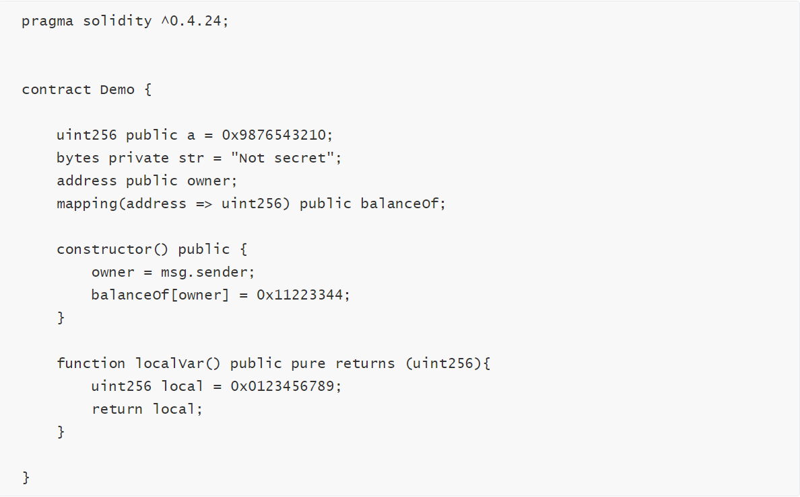
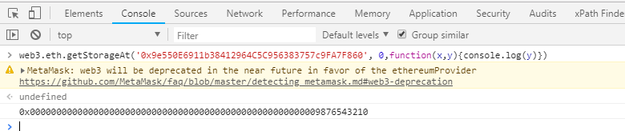
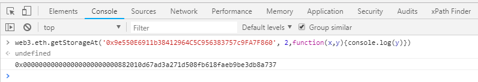
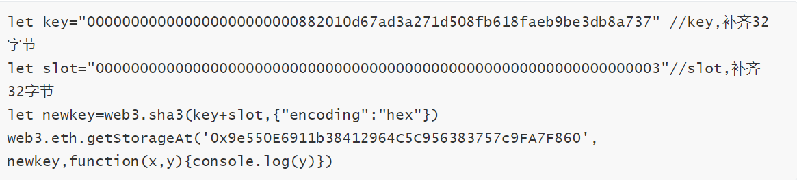
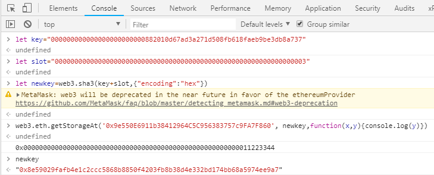
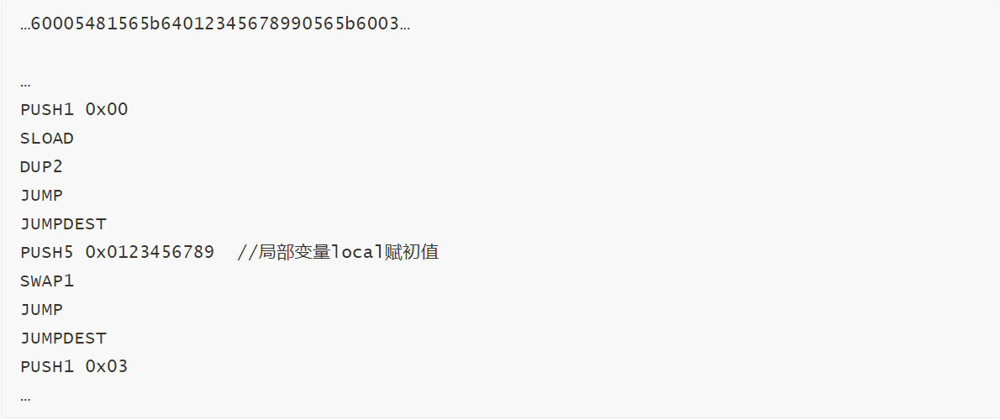

针对区块链安全问题，成都链安科技团队每一周都将出智能合约安全漏洞解析连载，希望能帮助程序员写出更加安全牢固的合约，防患于未然。


引子：外以欺于人，内以欺于心

 – 唐·韩愈《原毁》


**前景提要**


上回书，转账过程纷繁复杂，安全应对各个击破。


面对直接涉及以太转账的游戏合约， 在使用官方提供的转账函数同时，添加不同账户类型的区别处理以及失败情况下的异常处理乃明智之举。此外，构建合约逻辑避免依赖于合约余额确切值应铭记在心，如有特殊考虑，切记定义状态变量明确余额变化，万不可想当然而为之。


**本期话题**


第九回，合约安全隐私未必，外部读取暴露无遗。


我们在前几回主要讨论的都是在合约内部构建函数和代码书写规范时产生的一些误区和安全隐患。但是对于智能合约这个崭新的概念，仅仅从合约层面本身考虑合约的安全可能并不足够。合约开发者在这个产业蓬勃发展的过程当中，为了赶上项目进度，不得以边学习边实践，即使在代码书写层面功底很扎实的情况下，仍然会因为区块链技术的特殊性埋藏一些不自知的安全隐患。


所以，这一回我们将要阐述的安全隐患就是因为“合约中的一切都是公开可见”这一特性造成的。


**基础小知识**


在第七期的关于未初始化局部变量中我们介绍了变量存储的知识。Solidity对复杂的数据类型，比如数组和结构体，会默认存储在Storage当中。


没有提到的是关于智能合约中对于变量从作用域的划分。目前的划分包括三种，全局公有变量，全局私有变量，局部变量。


其中，全局变量一般储存在storage当中，而结构、数组或映射类型的局部变量，默认会放在 存储storage 中，除结构、数组及映射类型之外的局部变量，会储存在栈中。


公有（public）和私有（private）是可见性说明符（Visibility Specifier），公有变量在合约内部外部均可见，而私有变量仅在当前合约可见（可调用）。


另外还有两个可见性类别在这里我们也介绍一下：external，表示仅在外部可见，即仅可用于消息调用；internal，仅在内部可见，表示的意思是仅在Solidity合约与子合约均可见，不仅限于当前合约内。


**问题出在哪**


由于状态变量一般是需要永久存储的变量，所以一定会储存在storage中，联系第七期的知识，storage是存在于区块链当中的，可以类比为计算机的存储磁盘。那么状态变量其实一直存在于区块链当中，对于结构、数组或映射类型的局部变量也是同样的道理。


这样一来，即使加上了可见性说明符，例如私有状态变量，根据区块链公开的特性，它也还会是公开的，因为这个私有仅限于合约层面的私有，合约之外依然可以读取。


这个附加的可见性说明符就像骗子给皇帝穿上的新衣，以“骗”到合约层面的函数和变量，在合约外部却形同虚设。


**那么，从外部如何读取状态变量呢，下面我们从合约外部的角度分析具体的流程。**


**如何从合约外部读取变量**


**一、状态变量**


接着上面的概念，合约的状态变量都是存在于区块链中，就像存储在磁盘中的文件，因此，那么我们可以直接通过访问区块链获取这些状态变量的值。


例如针对以下案例合约进行全真模拟操作：





1. 将上面的合约部署在ropsten测试链上，获得地址`0x9e550E6911b38412964C5C956383757c9FA7F860`，

2. 然后登陆METAMASK钱包

3. 进入浏览器控制台console：


**1.   查看变量****a，输入：**


web3.eth.getStorageAt('0x9e550E6911b38412964C5C956383757c9FA7F860', 0,function(x,y){console.log(y)})


**会得到：**


****


**2.   查看变量str**


获取16进制结果，输入：

```
web3.eth.getStorageAt('0x9e550E6911b38412964C5C956383757c9FA7F860', 1,function(x,y){console.log(y)})
```

转换为字符串，输入：

```
web3.eth.getStorageAt('0x9e550E6911b38412964C5C956383757c9FA7F860', 1,function(x,y){console.log(web3.toAscii(y))})
```

**会得到：**


****


**3.     查看owner**


```
web3.eth.getStorageAt('0x9e550E6911b38412964C5C956383757c9FA7F860',2,function(x,y){console.log(y)})
```


****


**4.     查看balanceOf[owner]**


这个稍微复杂一些，由于映射变量不是按照定长变量的顺序存储，其是一个键值对，EVM采用的机制是将其存在sha3(key+slot)处





**输入进控制台，得到：**


****


**二、局部变量**


局部变量直接编码到opcode中，例如上面合约`localVar`函数中的`local`变量





**三、建议**


上面的读取操作验证了只要是储存在storage里面的变量，都是可以通过不执行合约函数就直接获取的。


因此，依赖可见性说明符，将隐私，不可公开的数据存储在区块链上是很不安全的做法。


如果真的要将隐私数据储存在区块链中，也要进行相应的加密处理。


**欲穷千里目 更上一层楼**


区块链时代的安全包含传统互联网安全，智能合约安全等多个方面，对于合约层面的安全考量固然是一方面，但是对于数据存储方面，不沿用互联网安全的理念，盲目信赖新技术却又不深入挖掘新技术某些特性、限制条件、特殊情况，势必无法做到真正意义上的全面防护。


目前区块链产业步伐放缓，正是我们深入学习了解这个领域的最佳时机，也是这个产业提升稳健性的最佳契机。更上层楼，与君共勉。


**参考资料：**


[1]: 

以太坊智能合约OPCODE逆向之理论基础篇：

https://paper.seebug.org/640/


[2]：

可见性和getter函数：

https://solidity-cn.readthedocs.io/zh/develop/contracts.html#getter


[3]: 

JSON-RPC#eth_getstorageat：

https://github.com/ethereum/wiki/wiki/JSON-RPC#eth_getstorageat


[4]:

以太坊数据存储的思考和解读：https://blog.csdn.net/Blockchain_lemon/article/details/79308137


[5]: 

How to read Ethereum contract storage：

https://medium.com/aigang-network/how-to-read-ethereum-contract-storage-44252c8af925
