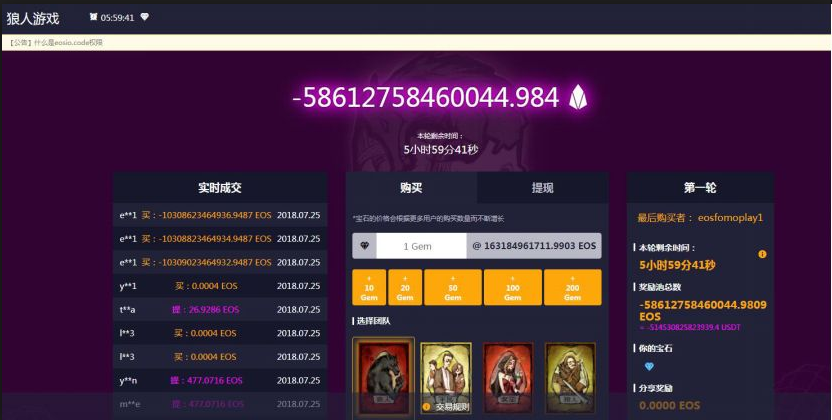
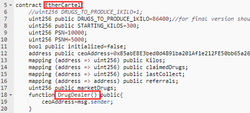
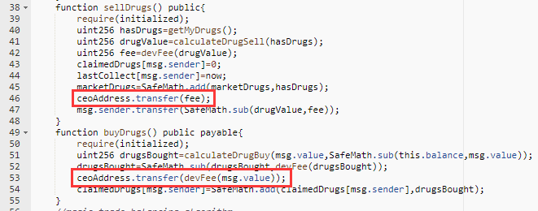
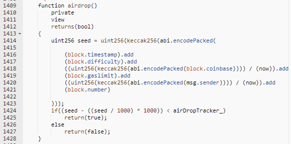
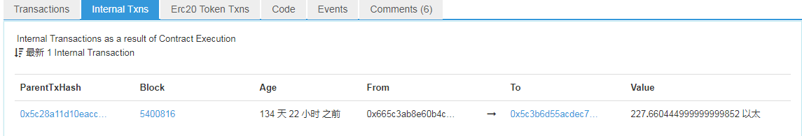

 针对区块链安全问题，成都链安科技团队每一周都将出智能合约安全漏洞解析连载，希望能帮助程序员写出更加安全牢固的合约，防患于未然。

 

*引子：故纸堆里寻惑源,多少旧事屡重演 —— 无名*

 

上回说到：地址恢复功亏一篑，

身份判断轻虑浅谋。

逻辑补全自圆其说，

原理辨析帷幄运筹。

 

本回， 区块链游戏江山如画，

安全防护未规划，

一片残阳西挂。

 

区块链行业日新月异，发展迅猛，各个公链及项目方奇思妙想层出不穷。俗话说，玩是人的天性，将数字货币与游戏结合，运用游戏的机制吸引投资者参与到互动中来的想法以标新立异、推陈出新的姿态引领了最近的潮流。各种区块链游戏聚集大量的虚拟货币，价值动辄上千万，承诺下的丰厚回抱吸引了越来越多的目光，投资者们跃跃欲试，人人都想充当“头号玩家”。

但是，缺少一套完整的、经过验证的SDK库是当下区块链游戏的一个痛点。各游戏方大都自食其力，独立开发游戏智能合约。比代币合约更加复杂的开发过程使得安全隐患不可避免的出现，这些漏洞一旦被攻击者或者项目方本身利用，受害的总会是玩家，可谓是，兴，百姓苦，亡，百姓苦。

 

成都链安科技对目前已经爆发的区块链游戏合约事件进行了归纳整理，分析目前游戏存在以下两个方面的问题：

**一，** **代码层面的安全问题**

目前代码层面的安全问题在游戏中的表现几乎与之前的代币合约如出一辙，但是包裹了鲜亮外衣之后，内部的代码结构严谨度依然差强人意，加上游戏机制的部分功能，有些合约代码甚至更加混乱。好比建造一栋楼房，基本结构没有搭建好，上梁不正下梁歪，增加更多的楼层与附属结构反而使得楼房的轰然倒塌更加迅速。

 

**漏洞归类与修复建议**

 

**1.**      **以溢出为代表的代码安全漏洞**

数学运算溢出在智能合约中是个比较大的安全隐患。无论是以太坊还是EOS，一个整型变量只能有一定范围的数字表示。例如，一个 uint8 ，只能存储在范围[0,255] 的数字。试图存储 256 到一个 uint8 将变成0。不加注意的话，只要没有检查用户输入又执行计算，导致数字超出存储它们的数据类型允许的范围，就会产生溢出，并可以被用来组织攻击。 此部分的具体原理在我们之前第一期，溢出漏洞全面分析中已经重点介绍过，没看过的请戳下面的链接：[*一夜回到解放前？溢出漏洞类型全面分析 |* *链安团队漏洞分析连载第一期* *——* *溢出漏洞*](https://mp.weixin.qq.com/s/J2F1QsbbqhSEmGRiqdW6ug)

下面我们来看游戏合约案例：

代表游戏：狼人游戏  

平台：EOS

从游戏网站上，可以很明显的看到，该合约执行发生了溢出，导致奖金池总额变为一个极大的负值，并且由于项目方应对措施不当，导致奖池奖金被盗取，普通玩家血本无归[1]。

*修复建议*

该游戏有三个问题需要大家引起注意：

（1）    代码开源问题，狼人游戏项目方并未公布合约源代码，玩家在参与游戏之前无法对项目安全性进行评估，自己的资产无法得到保障；

（2）    狼人游戏项目方要求用户提供的过大的权限，导致其有能力在用户未提供私钥的情况下，在后台修改权限，并转出用户的EOS；

（3）    对安全事件的应急响应，狼人游戏项目方未冻结攻击者账户，导致攻击者在升级后的版本中提出了6万多EOS。在此处，成都链安科技建议广大游戏项目方应在游戏合约的设计中引入安全控制机制，包括恶意账户冻结、暂停交易等，为游戏安全建立最后一道防线；

 

**2.**     **以owner权限盗取为代表的函数调用权限问题**

 

       此类漏洞的形成原因为构造函数失配或者修改owner的函数未添加调用者检查。智能合约的构造函数一般担负着合约初始化以及owner地址绑定的功能，如果构造函数声明方式不正确，那么，其会变成一个普通函数，任何人都可以调用他，并将自己设置为合约管理者。修改owner的函数用于将新地址设置为owner，此类函数需要检查调用者地址，如果确少该检查，那么任何人都能够将自己变为合约的管理者。

这与我们在开始连载之前的owner权限漏洞分析中的构造函数问题如出一辙，，需要了解请由以下链接传送：[*注意！3**份合约又存在Owner**权限被盗问题——低级错误不容忽视*](https://mp.weixin.qq.com/s/xPwhanev-cjHhc104Wmpug)

直接进入案例分析：

代表游戏：Ether Cartel

平台：以太坊

游戏的构造函数（DrugDealer）和合约名（EtherCartel）不一致，存在构造函数失配漏洞，导致DrugDealer变成一个普通的函数，任何人都能够调用该函数变成合约的ceoAddress，并且，根据后面的代码逻辑，他可以收取原本应该打入合约部署者的ETH[2]。

*修复建议*

为了避免此类漏洞，开发者在开发游戏合约时需要足够谨慎，并进行详尽的测试。构造函数仅在合约部署时执行一次，当出现合约部署后owner仍为0地址，并且用户可以调用实现构造函数功能的函数，那么，合约就存在构造函数失配的漏洞，开发者需要检查并修复构造函数实现。

 

**3.**     **“随机数生成”等区块链平台短板**

 

截止至目前，以太坊和EOS官方均未提供随机数接口，这对游戏开发确实是一个不利的影响，比如抽奖模块的开发。为了实现类似的功能，游戏开发者往往需要自己编写随机数生成函数，这些函数往往利用区块信息作为参数，然后进行一系列运算，获得一个“随机数”。但是，由于使用区块信息作为参数，这将导致在同一个区块上，使用相同算法的随机数函数将会得到相同的值，攻击者可以利用这点，部署中间合约，然后不停的尝试生成随机数，当生成满意的随机数时，再利用中间合约参与游戏，获得较大优势。

此外，区块链作为一个全球分布式的计算机，其资源目前是比较有限的，链的开发者为了保障链平台的稳定性，对链上的智能合约的运做出了限制，防止死循环等消耗资源的操作，比如，运行gas限制（以太坊）、CPU/内存资源限制（EOS），这使得链上游戏开发者需要比传统的中心化服务器游戏付出更大的努力，对游戏的逻辑进行优化，确保逻辑正确的合约不会因为资源限制问题而无法运行。

随机数问题我们在之前的快讯 [智能合约随机数算法漏洞影响游戏公平性](https://mp.weixin.qq.com/s/fnp980bzQjRqNEVuj518lA) 已经提及过，这次我们根据案例进行一下具体分析：

代表游戏：FoMo3D long

平台：以太坊

该合约空投函数的随机数生成使用的区块参数依次为block.timestamp(当前区块时间戳)、block.difficulty (当前区块难度)、 block.coinbase(挖出当前区块的矿工地址)、block.gaslimit(当前区块 gas 限额)、block.number (当前区块号)，结合msg.sender (玩家地址)，计算出玩家是否获得空投奖励，攻击者可以部署中间合约，预先计算出在当前块进入游戏是否能够获得空投，然后在结果为true的时候参与游戏，就必然能够获得空投，并以此牟利。

*修复建议*

针对随机数问题，目前有几点建议：

（1） 可以尝试官方推荐的随机数生成方式，比如以太坊的Solidity官方文档推荐用户使用链外的Oraclize库生成随机数；

（2）   杜绝中间合约参与游戏，以太坊开发者需要注意，使用以太坊平台提供的extcodesize函数并不能完全判断某个地址是否为合约，因为合约在部署的时候，其extcodesize为0，但是可以在构造函数与其他合约进行交互，从而参与游戏，可以使用tx.origin==msg.sender的方式判断。

 

**4.**  **利用竞态条件机制发起的攻击**

 

目前有些类似博彩的游戏合约似乎更加受到欢迎，此类游戏合约有一个共同的特点——时间依赖。它们都是在一定时间段内与用户进行互动，时间截止之后宣布获奖者名单。这样取决于时间点的游戏留下的隐患是：攻击者可以将整个区块“塞满”交易，使得特定的交易无法进行。 攻击者会使用高昂的gas使其成为整个区块中唯一一个交易进行者。

案例分析：

代表游戏：Exitscam/FoMo3D

平台：以太坊

以太坊版的FoMo3D规则类似于透明“金字塔骗局”

（1）    每一局持续固定的时间

（2）    如果你是最后一个向奖池中投注的人，你拿走头奖（奖池总奖金的90%）

（3）    如果有人在你之后投注，你会获得一定的分红。目前，分红金额低于投入ETH的1%

（4）    每0.005 ETH会给结算时间增加30秒，也就是2个区块，但每次增加上限为24小时

利用竞态条件的概念，赢得此游戏，获得头奖的策略很简单：当倒计时即将结束，趋近于0时，向奖池投注ETH，“买“下之后的每一个区块直至倒计时结束，保证没有人能够在你之后投注。如果这个操作实现，你将获得头奖[3]。

这个游戏的机制漏洞几乎与之前提到的交易顺序依赖（TOD）异曲同工，竞态条件我们在第三期连载分析中也有描述，链接如下：[*弯道超车老司机戏耍智能合约 |* *成都链安漏洞分析连载第三期* *——* *竞态条件漏洞*](https://mp.weixin.qq.com/s/WWouXpxoejY_2oRs9TS38Q)*。*

修复建议

游戏开发者需要熟悉重入和交易顺序依赖两种类型的竞态条件漏洞，类似的游戏机制如若可以利用相似的概念被投机取巧，应当改变设计思路，兼顾设计初衷与安全保障。

 

**二，**    **游戏本身可信度问题**

虽然区块链上所有的交易都是公开透明的，但这不代表游戏项目方在合约开发的过程中不能留有后门。尤其是尚未公布源码的游戏合约，其中可以暗藏一个函数，开发者只要调用这个函数就能卷走所有的货币。而目前尚未出现一款可靠的反编译器，对字节码进行反编译后，使其源码真正公开透明。

如果还拿建造楼房做比喻的话，可以理解成在建造的时候就设计成歪的，一直住在其中的用户却并没有察觉。

 

**事件回顾**

代表游戏名称：Power of Bubble

平台：以太坊

 

从4月7日到4月8日早上10点，游戏项目方在Discord各频道开始了疯狂的宣传，利用精美的外形设计和丰厚的奖励承诺牢牢吸引了大批的粉丝翘首以盼。8日早上10点开服后10分钟内，合约内资产已超过200ETH，但是随着时间的推移，玩家们开始发现讨论群消失了，游戏内的出售以及提取操作也无法完成。最后，奖金池中227个以太在众目睽睽之下被合约创建者转走[4]。

区块链游戏往往需要各种虚拟货币作为游戏资产，整个游戏中所有涉及到虚拟货币持有、分配的合约都应当开源，供玩家和审计方审核，确保没有潜在后门。同时玩家也应该提高警惕，在将自己资产投入一份源码未知，未经审计的区块链游戏时，要做到理性投资。

 

**路漫漫其修远兮**

将区块链技术应用到游戏上，其发展时长其实并不比区块链货币交易短很多。区块链游戏到目前为止已经可以划分为3个时代，从1.0时代的《加密猫》，到2.0时代的《以太水浒》，都属于收集玩法为主的区块链游戏时代。目前的3.0时代是链上加链下多种玩法结合的时代，但是在众多RPG区块链游戏兴起的同时，庞氏骗局型区块链游戏也开始兴风作浪，这类游戏的交易属性较重，而且往往缺乏长期的游戏属性。展望4.0时代，区块链游戏应当更加注重于其游戏性，也就是说在玩法上更加接近传统游戏。但是与传统游戏相比，区块链游戏在三个方面有较大优势[5]：

\1.     账号安全：玩家的登录信息加密过后被储存在钱包内，安全性相较于传统登录模式有较大提升

\2.     服务器：服务器安置在区块链上，即使游戏运营方停止其官方服务器，玩家也能继续享受游戏

\3.     公平性：由于游戏内信息公开透明，并且可追溯，滥发，更改道具的行为将更容易被识别，进而大幅下降。

 

然而，基于以太坊开发与传统游戏机制相同的仍然存在许多劣势：

\1.     以太坊的吞吐量限制了游戏玩家的数量和增长速度

\2.     鉴于目前以太坊交易速度的限制，很多游戏没有办法像传统游戏一样做到低延迟和实时互动

\3.     每笔交易需要手续费对游戏内的交易增加了负担

目前，更多公链和资本介入区块链游戏的开发，目的是为其研发新的模式技术奠定更坚实的基础，或许再过不久，会有专门为游戏而生的公链出现，给区块链游戏一个专属的舞台。同时，开发者们已经把重心转移到多玩法的方向，试图弱化交易属性、减少庞氏骗局类型游戏，将区块链的技术优势附加到已经很成熟的传统游戏市场，为游戏产业带来一个新的纪元。

 

但无论是以交易属性为主还是以游戏性为主的区块链游戏，都离不开智能合约的编写和审计。所以重中之重还是要在发展的同时，保证合约安全属性的验证，对于上述问题游戏合约，对照之前的漏洞分析不难发现，很多项目方依然在重蹈覆辙，对于异常明显的常规漏洞没有采取补救或者防护的措施，带给玩家巨大的经济损失，也给区块链游戏的天空平添一抹阴霾。 保证合约的质量，让区块链游戏快速走出混沌期，每一个项目方和开发者责无旁贷。

 

参考链接汇总：

[1]: [EOS版Fomo3D因漏洞终结 资金盘游戏背后现多重风险](https://mp.weixin.qq.com/s?src=11&timestamp=1534753675&ver=1071&signature=6LpTAWjNZt0eNKBrEn45MVDw4RvrNUu7Qd-Y89noi0NukyTOyuxtocEM478hCZVSmOjq5Qn0te5wx1Gc1CxnS3lW1vkuYkUWy0a1OHnbQQqtmnWEbSh3brCmI28jS2t7&new=1)

[2]: 数个区块链游戏智能合约爆出ceoAnyone漏洞(CVE-2018-11329)(https://peckshield.com/2018/05/21/ceoAnyone/)

[3]: [The Buy-A-Block Attack](https://medium.com/coinmonks/the-buy-a-block-attack-c0ce845475d7)

[4]: 这伙骗子仅用十分钟就骗走了227个ETH(https://mp.weixin.qq.com/s?src=11&timestamp=1534813285&ver=1073&signature=tsXvGYcevTKeYIkkVQkTT0MuvdcNexQTsjK-5BAVyS5mNSMFeFU2hIm4GBXlL5KVBAl-pRMW*Iba1cAci1oicRVD3Quh9mAnb*-I8oRBslNwBu8GPxHtFIhUDjcWOYZX&new=1)
[5]: 区块链游戏是什么？跟传统游戏有什么区别？(https://www.zhihu.com/question/279195102)

 

 