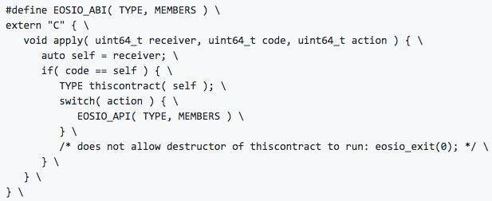
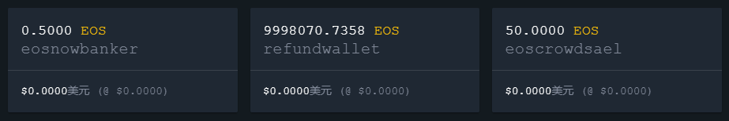
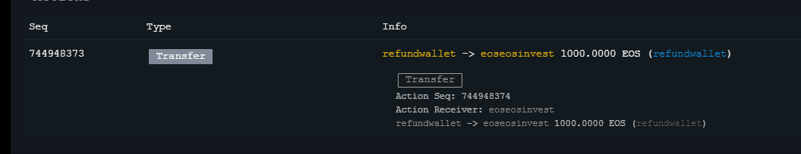
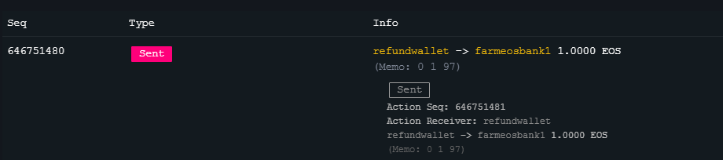
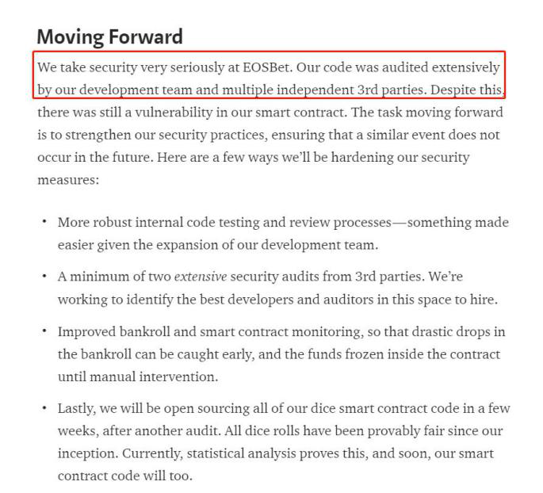

*针对区块链安全问题，Beosin**（**成都链安**）**团队每一周都将出智能合约安全漏洞解析连载，希望能帮助程序员写出更加安全牢固的合约，防患于未然。*

 

*引子：寓目暂为实，过者即为虚。—— 《俨上人粹隐堂》 宋·梅尧臣*

 

 

**前情提要**

上回书，EOS游戏屡遭毒手，随机数漏洞屡禁不绝。

 

当下正值各种EOS DApp火爆的时期，许多项目方纷纷开发自己的EOS游戏吸引玩家。由于EOS官方并没有提供随机数接口，EOS游戏在随机数生成问题上面临和以太坊游戏一样的窘境，开发者无法确保随机数算法中的因子是不受其他因素干扰的完全随机因子，因此EOS游戏随机数攻击一而再，再而三的发生，项目方也采取修改相关算法的措施应对类似风险，如何做到正确修改，就要看开发者对随机数因子的生成机制是否了解透彻，必要时还是需要借助第三方审计，做到随机数问题上的万无一失。

 

 

**本期话题**

DApp假币鱼目混珠，转账函数检测疏漏马虎

 

说起今年比较卖座的国产电影，周润发的《无双》肯定占有一席之地，电影中美元假钞的制造技术让人惊叹，也演绎了一段残酷的“钞级骗局”。

​              

钞票不够用，就想到自己制造印刷，以假乱真，但是像影片中那种精湛的技艺确实还是很少的。在利益面前，任何一种货币都有被伪造的风险。对于EOS也不例外，本期我们就来说说由伪EOS攻击引出的相关漏洞及其变体。

 

 

**基础知识铺垫**

EOS智能合约的架构

 

EOS智能合约是由一系列action组成的，每个action代表一条合约条款，以实现条款中的具体规则。执行一个EOS智能合约分为制作、部署、调用三个部分。

其中，在部署智能合约这一步，每个EOS智能合约必须实现一个apply()函数，作用是将action请求映射到具体的处理函数。具体的实现细节封装在EOSIO_ABI宏里面。这样的设计让开发者只需要专注业务逻辑的开发，而不必关注底层技术，起到简化开发的作用。apply函数示例：

 

 

 

**伪EOS转账攻击**

**历史事件：**

大名鼎鼎的EOSBet在9月12日损失约42,000 EOS，开始了黑客使用伪EOS token攻击的热潮，接下来就是eoswindice和去中心化交易所newdex，都沦落为黑客的“鱼肉”。

 

**攻击分析：**

在EOS链上通用代币为EOS token，EOS token是由EOSIO部署的eosio.token合约生成的，但是eosio.token代码是开源的，任何eos账户都可以自己部署eosio.token合约，并且发行缩写名为EOS的token，如图我们可以看到大量无价值的伪EOS：

 

 

如何鉴别真伪EOS呢？验钞机吗？当然不用， eosflare浏览器上会显示token的全名，真EOS和假EOS全名是有区别的：

从图中可以看到 一个是EOS且后面没有其他说明，另一个是refundwallet伪造的EOS (refundwallet)。

 

在浏览器中，我们可以看到交易细节来判断用来交易的EOS token是真是假，那么如果放在智能合约中呢？

比如案例合约：

void transfer(const account_name& from,

​                            const account_name& to,

​                            const asset& quantity,

​                            const string& memo)`

这是一个用来接收回调的函数，在被传递假EOS时，函数是没有办法分辨真伪的。如果没有提前在apply中检测EOS真假，就会导致合约接收了假的EOS也会执行正常业务逻辑。如果恶意账户自己部署合约发布一个EOS token，就可以实现空手套白狼，用假钞换真钱。

 

**漏洞修复：**

为了验证EOS的发行方为eosio，需要在apply()中添加code == eosio.token进行判定。

还有一种修复方法，开发者可以使用extended_asset类型接收asset 然后调用其中的contract可以获取到token的合约信息，extended_asset quantity然后可以对quantity.contract验证。

 

**变体1：对****transfer****函数的直接调用攻击**

 

**漏洞分析：**

按照上述漏洞修复手段添加相关判定后，许多项目方长吁了一口气，但是引发EOSBet事件的漏洞代码并没有那么简单就被修复。因为，在使用上述的apply对code调用进行检测时，还存在另一种绕过的情况，检测条件如果只为：

 

if( code == self || code==N(eosio.token) ||action == N(onerror))

 

那么这个检测条件只处理两个检测：函数自身action的调用和来自eosio.token的action的调用，没有校验transfer action的调用方必须是eosio.token或自己的合约。

 

这样就会导致可以直接调用合约账户下的transfer。

比如，原本是用户A调用eosio.token给用户B转1 EOS，然后eosio.token发送trasfer回执调用到B合约transfer函数执行业务逻辑，现在的话就可以直接调用B合约的transfer函数，里面指定from，to，value等正确的参数，不通过转账直接执行到B合约的业务逻辑。所以进攻EOSBet的攻击者完全绕过eosio.token->transfer函数，直接以正确的参数调用eosbetdice11->transfer，在不将EOS转移到合约的情况下执行了合约的业务逻辑。

 

**漏洞修复：**

对于这一类攻击的防御方式主要是同时对action和code做检测，即当

(code == N(eosio.token) && action == N(transfer)时才执行transfer函数。形式如下图：

if (code == N(eosio.token) && action == N(transfer))                     	

​        {                                                                       	        }  

 

**变体2** **EOS假回执攻击**

 

**历史事件：**

在9月14日的事件之后，EOSBet还发过官方声明提到他们对代码安全的重视程度。

 

但是就在一个月之后，10月15日，EOSBet又被黑客攻击，损失近14万EOS。

 

**漏洞分析：**

漏洞原因是智能合约处理逻辑的transfer函数内缺少对to的判断：如果缺少to判断，合约无法判断收到转账的是不是自己，可能在没有收到转账的情况下继续执行逻辑功能，假设攻击者拥有AB两个账户，c是游戏合约账户，攻击者可以通过A账户调用eosio.token转账EOS到B账户，然后在A或B账户部署合约，在回调transfer中再调用一次require_recipient(N(XXXXXX));将转账通知发送到游戏合约C账户，这样就可以绕过code==N(eosio.token)&&action==transfer的校验，执行相应的业务逻辑。

 

**漏洞修复：**

void transfer(const account_name& from,

​                            const account_name& to,

​                            const asset& quantity,

​                            const string& memo) {

​    	if (from == _self || to != _self) {//不能缺少to != _self判断

​        	return;

​    	}

 

**代码安全非黑即白**

 

受到攻击的游戏官方经过一系列的安全事件、代码修复才最终解决了一个看似很匪夷所思的漏洞。可以看出，区块链安全是一个异常严谨、值得考究的技术，近两年的磕磕碰碰又让它成为了一个非常沉重的话题。《无双》中有句台词，“只看到黑跟白的人，永远都是失败者。”这句话在区块链领域并不适用，不信你看电影主角的结局。

 

区块链项目需要做到代码层面上的逻辑严密，设计精巧。区块链安全规范和相关知识也需要理解透彻，融会贯通，在细节问题上的把握也异常重要，尤其是对于起步不久的EOS、Fabric等新平台，所以可以说区块链技术在代码安全方面非黑即白，做到安全开发、安全审计、安全部署，才能让攻击者、投机者无从下手。

 

 

 

引用：

 

[1]: 假EOS攻击再升级：EOSCast遭黑客“假EOS转账变种”攻击，损失超6万EOS <https://www.huoxing24.com/newsdetail/20181101120201461288>

[2]: BET被黑客攻击始末，实锤还原作案现场和攻击手段<https://bihu.com/article/1358201
[3]: 震惊！EOSBet又被攻击了。损失高达500万。攻击手法竟是这样？<https://bihu.com/article/1558677

[4]: How EOSBET attacked by aabbccddeefg <https://www.reddit.com/r/eos/comments/9fpcik/how_eosbet_attacked_by_aabbccddeefg/>

[5]: EOSBet Transfer Hack Statement  

<https://medium.com/@eosbetcasino/eosbet-transfer-hack-statement-31a3be4f5dcf>