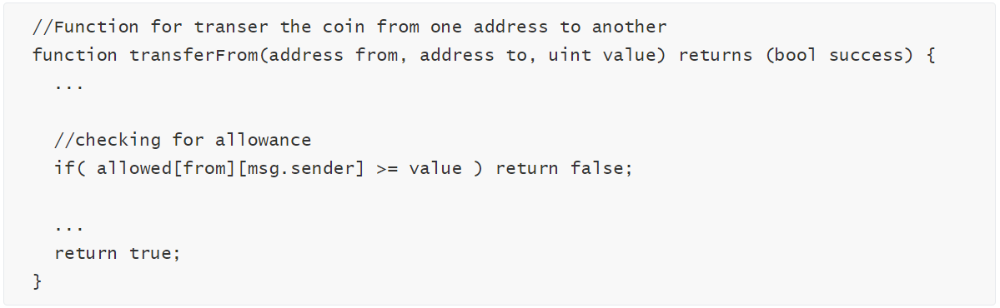
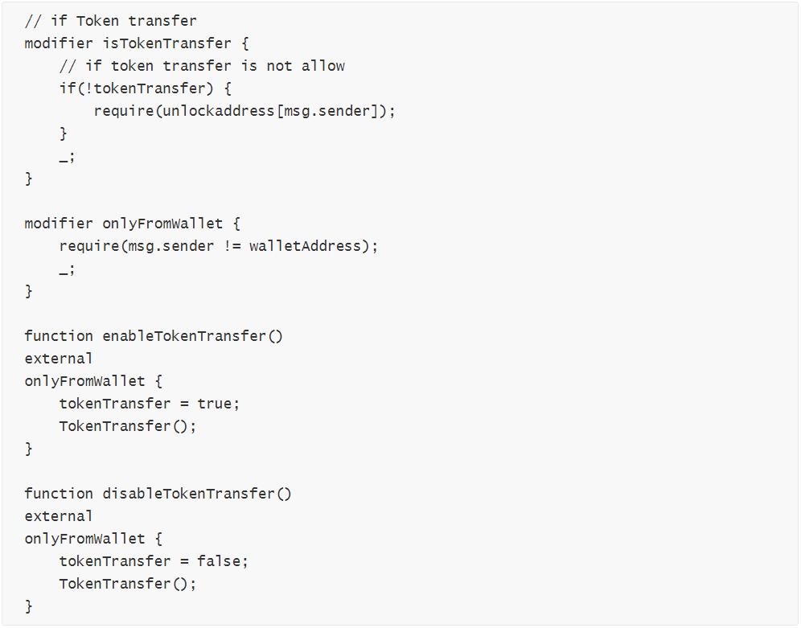
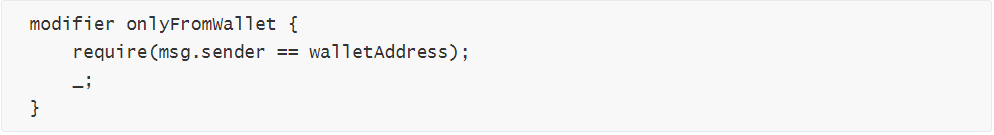
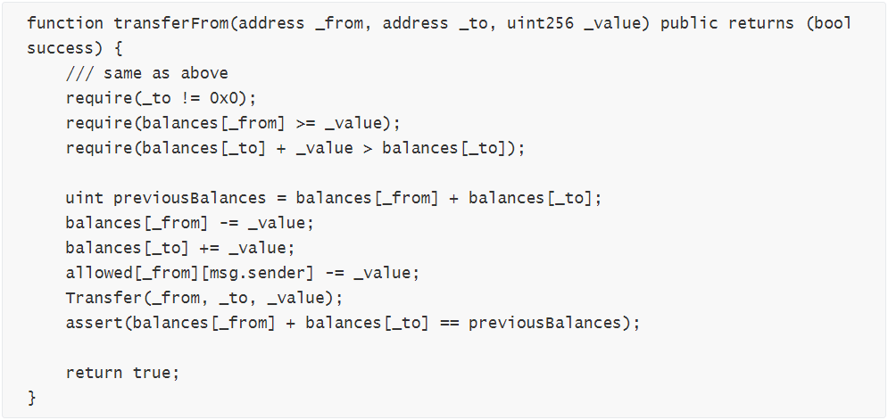
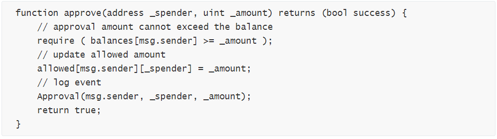
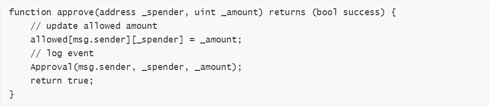
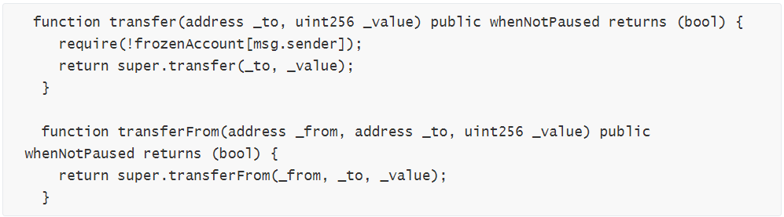

针对区块链安全问题，**成都**链安科技团队每一周都将出智能合约安全漏洞解析连载，希望能帮助程序员写出更加安全牢固的合约，防患于未然。*

 

*引子：出尘花品爱池荷，零落秋风可奈何 ——* *《病中咏秋荷》清·蔡桓*

 

 **前情提要**

上回书说到， 除法运算四舍五亦舍，浮点精度数小事不小

 

在合约的数学运算中，除法属于比较特殊的一类，其结果只保留整数部分。如果使用小分子大分母的运算基数，将会造成精度上的误差。对于此类运算，应从精度的设计、运算和表示三个方面入手，采用“大分子”、“运算顺序调整”、“运算前精度转换”三种方式来提高运算结果的准确度。在处理反映经济决策的比例，保持智能合约的正确精确度非常重要，这同时也是以太坊官方的一个努力方向。

了解了数据相关的知识，我们这期再回到逻辑与功能方面的安全问题。

 

**本期话题**

逻辑判断失误事与愿违，功能实现不周弄巧成拙

 

智能合约作为区块链技术革命的核心，乘着以太坊兴起的潮流，发展至今已经两年有余。智能合约的理念最早可以追溯到1995年，几乎与互联网同时出现。广受赞誉的密码学家尼克萨博最早提出了这个术语，他也是为比特币打下基础的学者之一。随着比特币的出现和应用，让智能合约的理念有了实现的机会。

 

*尼克·萨博对于智能合约的描述*

从原理上来说，智能合约的执行依靠的是条件的触发，也就是类似于程序中的if-then语句。也就是说，智能合约对于其中合同条款的执行取决于预先编译好的逻辑判断，进而与真实世界的资产进行交互。本期，我们归纳总结了一些在从设计到实现的过程中出现安全漏洞。

​                                 

​                             **智能合约愈发复杂**

 

我们都知道，一个智能合约包含两部分：代码逻辑和数据。

相比于比特币的脚本语言，智能合约发展的一个终极目标就是“图灵完备”，简单来说，就是无论怎样复杂的交易逻辑或功能都可以实现。

智能合约的开发经过一段时间的沉淀，已经由最初简单的转账、付款等功能需求，向越来越多的交易功能和逻辑进化，比如冻结、暂停、中止、授权。根据复杂性理论，越复杂的系统越容易有出错的可能。因此，越是功能强大的智能合约，其逻辑就越是复杂，也越容易出现逻辑上的漏洞。

 

​                             

​                         **开发合约也会言多必失？**

打个比方来说，逻辑更加复杂的代码相当于更庞大的城池，在容纳更多人口的同时，需要防守的地方也更多。有些精心设计而又容易忽视防范的地方，比如错综复杂的下水道系统，正是容易让整个城池沦陷的重大隐患。

 

同样，在智能合约中，开发者为自己的合约设计的特殊功能意在稳固代币的市值或者项目的寿命，而正是在这些逻辑和功能中，一个细微的失误，比如>、<、+、-这些符号的错误就可能导致整个逻辑与预想出现严重的偏差，留下致命的隐患。

 

​                            **代码实现失误漏洞总结**

 

我们将代码实现过程中产生的失误分为两种：

\1. **逻辑判断错误**

Solidity的if或者require等条件判断表达式对合约代码执行做出限制，开发者如果在编写合约时写出了错误的判断条件，将会造成比较大的逻辑错误，影响合约正常使用。

 

a) **t****ransferFlaw**

在transferFrom()函数中，当对allowance值做校验的时，误将校验逻辑写反，从而使得合约代码的逻辑判断错误。有可能造成溢出或者任何人都能转出任何账户的余额。

我们来看一个案例

 

if( allowed[from][msg.sender] >= value ) return false;此处校验逻辑写反了，导致只要授权值allowed[from][msg.sender]小于转出额度，那么都能转账成功，利用这个漏洞，可以不经授权就可以转出他人账户中的代币。

l 漏洞修复

推荐使用require(allowed[from][msg.sender] >= value);语句对授权额度进行判断

 

b) **pauseTransfer-anyone**

以如下案例合约为例

 

onlyFromWallet 中的判断条件将 == 写反了，写成了!=，使得除了 walletAddress 以外，所有账户都可以调用 enableTokenTransfer() 和 disableTokenTransfer() 函数，这两个函数可以开启或者关闭合约的转账、授权以及烧币功能，进而影响合约的正常使用。

l 漏洞修复

使用正确的require判断语句：

 

 

c) **allowAnyone**

分析如下案例合约

 

在transferFrom函数中，转账前未对allowed进行校验，转账后对allow的计算也未使用SafeMath， 使得任何账户都可可以不经授权就能够转出他人账户中的代币，并且，如果转账额度_value大于allowed[_from][msg.sender]，allowed[_from][msg.sender] -= _value将发生溢出。

l 漏洞修复

i. 在转账前增加对allowed的检查，require(allowed[_from][msg.sender]>=_value);;

ii. 使用SafeMath对allow进行运算，

allowed[_from][msg.sender] = allowed[_from][msg.sender].sub(_value);

 

d) **approve-with-balance-verify**

部分合约在函数approve()中，增加对被授权账户余额的校验，要求授权的_amount小于或等于当前余额。

一方面，对余额的校验并不能保证被授权账户一定可以转出这个数量的金额:

i. 在approve之后，token的所有者自己通过transfer函数，把token转走，导致余额小于allowance。

ii. approve给多个人，其中一个人进行transferFrom操作后，可能导致余额小于之前给其他人approve过的值。

另一方面这个校验可能导致外部合约（如以0x协议为基础的去中心化交易所）无法正常调用，必须由Token 项目方提前转入一笔数额巨大的 Token 至中间账户才能继续执行。

例如下面这个合约

 

l 漏洞修复

去掉balances[msg.sender]的校验:

 

 

 

\2. **功能实现与设计不符**

我们来详细分析如下案例合约：

 

上述两个函数重写了ERC20标准中的transfer和transferFrom函数，添加了对冻结账户的检查。

在transfer中，如果msg.sender被冻结，那么其不能进行代币交易。

但是，我们注意到，在transferFrom中，并没有对代币转出地址（_from）的检查。

如此一来，一个被冻结的地址可以通过授权第三方，然后通过第三方地址向目标地址发送代币，违背了设计中对冻结地址的限制。

l 漏洞修复

在合约正式上链前，项目方应对合约进行充分的测试，确保其实现完全符合设计。

 

​                       **我本将心向明月，奈何明月照沟渠**

以上的安全漏洞都是开发人员在实现某些功能需求时，出现低级错误或者只追求完成功能需求导致的。相信在漏洞被曝光或者被攻击者利用时，开发者的内心也是崩溃的，感觉枉费了一番苦功夫。在没有相关测试、审计团队的协助下，对于此类实现与设计不符的漏洞可能真的束手无策，尤其是关于合约逻辑的检测，可能需要用到形式化验证运用数学建模的方法对于合约进行描述之后才能查遗补漏。但是，汲取他人教训并且用于提高应该是每个先驱者在探索新领域时具备的素质，一个人可能会走的更快，而一群人，会走得更远。

 

