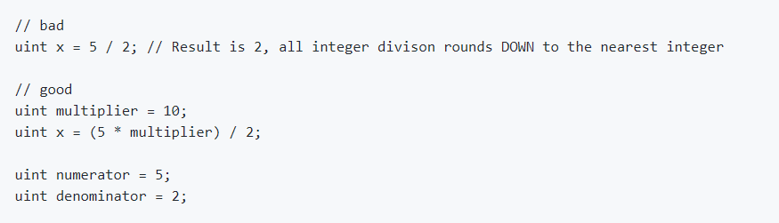
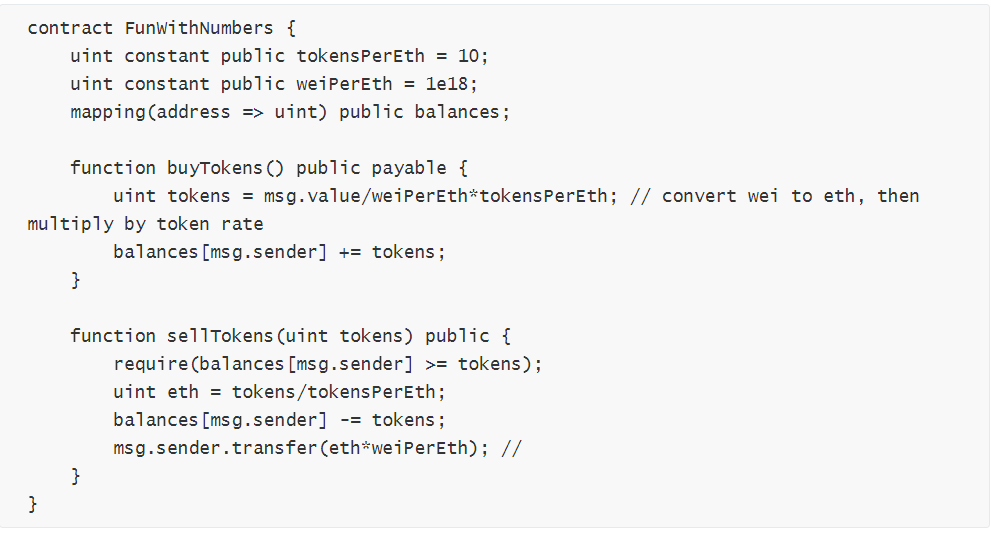

除不断，理还乱的合约运算 | 成都链安科技漏洞分析连载第十二期 —— 浮点和精度处理不当

 

*针对区块链安全问题，**成都**链安科技团队每一周都将出智能合约安全漏洞解析连载，希望能帮助程序员写出更加安全牢固的合约，防患于未然。*

 

*引子：“言治骨角者，既切之而复磋之；治玉石者，既琢之而复磨之，治之已精，而益求其精也。”—— 宋·朱熹*

 

​                                    **前情提要**

上回说到，继承变量名同实不同，构造函数名异失其义

 

在书写智能合约的过程中，采用正确的构造函数声明以及保持合约名与构造函数名一致是保证构造函数特殊性、唯一性的先决条件，也是构建合约安全基础的重中之重。构造函数中的owner权限既不可过于强大也不可落入他人之手。继承中的父类函数变量和新声明的子类函数变量有微妙的差别，名字相同的情况下，调用父类函数操作的会是父类的变量。辨析和理解这些细枝末节才能防止在开发中出现失误，同时防范蜜罐的类似手段套取资金。正确规范的使用名称也体现了开发者对项目和安全的尊重。

 

​                                   **本期话题**

 

除法运算四舍五亦舍，浮点精度数小事不小

经过十一期的讲解和学习，我们渐渐由常见的严重漏洞延伸到了合约开发的细节和不易察觉的安全隐患，旨在倡导更加细致的安全开发过程和专注安全防范的“工匠精神”。在连载开启伊始，我们提及了臭名昭著的整型溢出漏洞，并强调使用SafeMath库对溢出进行检查来防范严重后果。深度阅读请移步：[溢出漏洞类型全面分析](https://mp.weixin.qq.com/s/39YOnunVocaEYjjjUIWbjw)。

然而，在合约的数学运算中，其实不仅仅只有溢出的问题，还有与精度密切相关的除法运算以及浮点。说起浮点和精度，这是计算机最为基础也是最有争议的一个话题，曾经听说过再简陋的计算器也比超级计算器的精度高的说法。举一个很实际的例子，你使用主流编程语言计算0.2+0.4，测试可以用Chrome，FireFox浏览器，按F12键进入控制台（console），然后输入计算结果，出来的结果竟然是：

 

然后再用最简陋的计算器，手持计算器或者系统自带的计算器计算一下结果，肯定是0.6，相比之下一目了然。所以我们可以说，计算的精度关键不在于它的频率和内存，而在于它是如何设计、表示、以及计算的。

在Solidity中，浮点和精度也存在类似的争议，本期我们就来探讨计算浮点产生的精度漏洞。

 

​                                **基础知识**

针对Solidity，我们需要了解以下两个方面的内容

\1. 浮点型，定长浮点型

Solidity 目前暂时仍不支持浮点型，也不完全支持定长浮点型。

其中定长浮点型在Solidity中可以用来声明变量，但是并不能用来赋值。

fixed/ufixed: 表示有符号和无符号的固定位浮点数。关键字为ufixedMxN 和 ufixedMxN。

M表示这个类型要占用的位数，以8步进，可为8到256位。

N表示小数点的个数，可为0到80之前

\2. 除法运算

除法运算的结果会四舍五舍，只取整数部分。例如如下的运算展示了直接用5除以2，以及用分数表示5除以2结果的表示方法比较。

 

这说明所有除法的运算结果，如果出现小数，小数点后的部分都会被舍弃，只取整数部分。

所以，官方给出的建议是，如果你需要更高的精度，请考虑使用乘数，或储存分子和分母。

 

​                          **数学计算无误，运算结果偏差**

试想，如果在代币的运算中出现运算结果小于1Ether的情况，那么0.XXX就会被约等于0. 同样4.9个代币也会被约等于4个，带来一定程度上的精度流失。由于代币的经济属性，精度的流失就相当于资产的流失，所以这在交易频繁的代币上会带来积少成多的问题。这让我想起了全国人民每个人都给我一毛钱的暴富笑谈。

 

 

​                                **案例漏洞分析**

上面我们说到，Solidity最新的版本为0.4.25，其仍不支持浮点型或者定长浮点型，一般用Solidity中的整型来表示浮点数，例如ERC20中的Token，如果使用未正确的转换，可能会出现错误甚至漏洞。

 

由于Solidity中没有浮点类型，因此开发人员需要使用标准整数数据类型来实现它们自己的类型。在这个过程中，开发人员可能遇到一些陷阱。

 

让我们从一个代码示例开始（为简单起见，忽略任何over / underflow问题）。

 

这个简单的代币买/卖合约在代币的买卖中存在一些明显的问题。虽然买卖代币的数学计算是正确的，但浮点数的缺乏会给出错误的结果。例如，当使用uint tokens = msg.value/weiPerEth*tokensPerEth; 计算能够获得多少token时，如果发送的Ether数量小于1

Ether，最初的除法将导致结果为0，进而使最后的乘法结果也是0（eg：200 wei除以1e18weiPerEth等于0）。

同理，当销售代币时，数量少于10代币的情况下将会收到0 ether。事实上，这里四舍五入总是向下约等于最近的整数，所以比如销售29 tokens，将只能收获2 Ether。

 

这个合约的问题是精度只能到最近的Ether（即1e18 wei）。当面临更高的精度时，例如使用decimals扩展精度的ERC20代币，事情会变得很棘手。

 

​                                    **漏洞修复**

保持智能合约的正确精确度非常重要，尤其是在处理反映经济决策的比例或者比率时。

解决方案：

\1. 大分子 

所以我们应该确保使用的任何比例或比率都在分数中拥有大分子。例如，我们tokensPerEth在示例中使用了费率。使用weiPerTokens这将是一个很大的数字，效果自然会更好。这样可以解决我们用msg.sender/weiPerTokens计算的代币数量问题。同时给出更精确的结果。

\2. 运算顺序

要记住的另一个策略是注意操作的顺序。在上面的例子中，购买代币的计算是msg.value/weiPerEth*tokenPerEth。请注意，这里的除法发生在乘法之前。如果计算首先进行乘法，然后再进行除法，那么这个例子会达到更高的精度，例如修改为msg.value*tokenPerEth/weiPerEth。

\3. 精度转换

最后，当为数字定义任意精度时，将变量转换为更高精度，执行所有数学运算，然后最后在需要时将其转换回输出精度不失为一个好主意。通常uint256使用它们（因为它们对于gas使用来说是最佳的），它们的范围约为60个数量级，其中一些可用于提升数学运算的精确度。

可能会出现这样的情况：最好先将所有变量高精度地保持稳定，然后在外部应用程序中转换回较低的精度（这实际上是ERC20代币合约中decimals变量的工作原理）。要了解如何完成此操作的示例以及要执行此操作的库，可查看[Maker DAO DSMath](https://github.com/dapphub/ds-math)。

 

​                             **精度无小事，细节定成败**

从上面的漏洞修复手法我们可以看出，三个措施正好对应了精度的设计，精度的运算，精度的表示三个方面。从这个角度来看，智能合约运算中的精度问题其实追根究底也是计算机精度问题的延伸。但是由于区块链产业目前的经济属性，精度无疑成为安全的一个重要考量，在精度的问题上多下功夫，有益无害。根据官方的消息，Solidity或者其他开发语言在以后也会在浮点和精度的问题上做进一步的完善和提升。说明官方也在努力为这个产业安全性准确性的进行不断完善。我们在关注和投身这个产业的过程中，做好细节的完善，也是为其添砖加瓦的一种最好体现。

 

 
