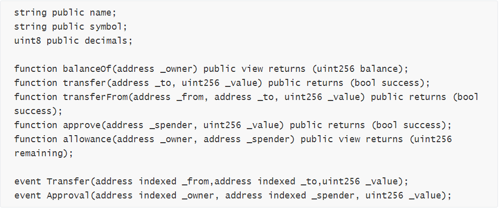
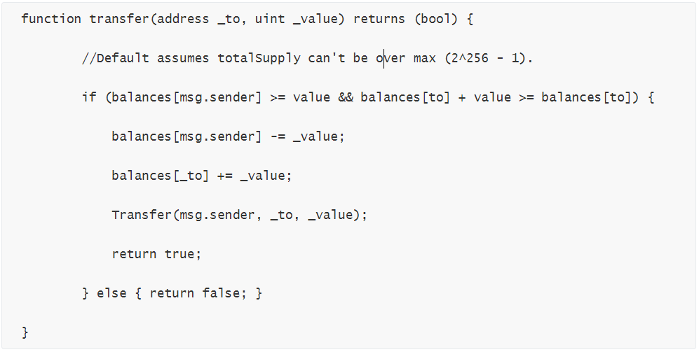
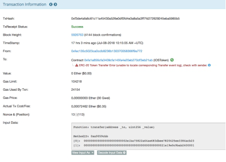
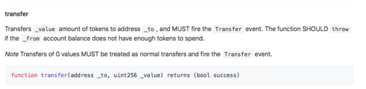
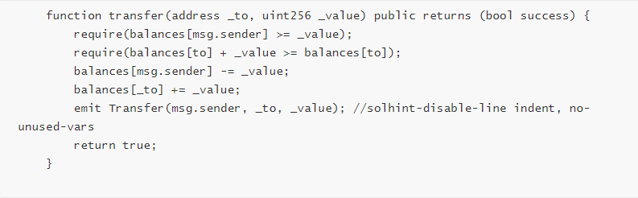
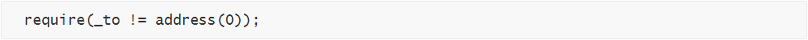
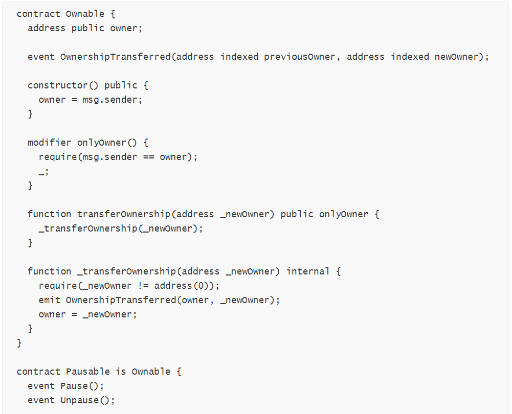
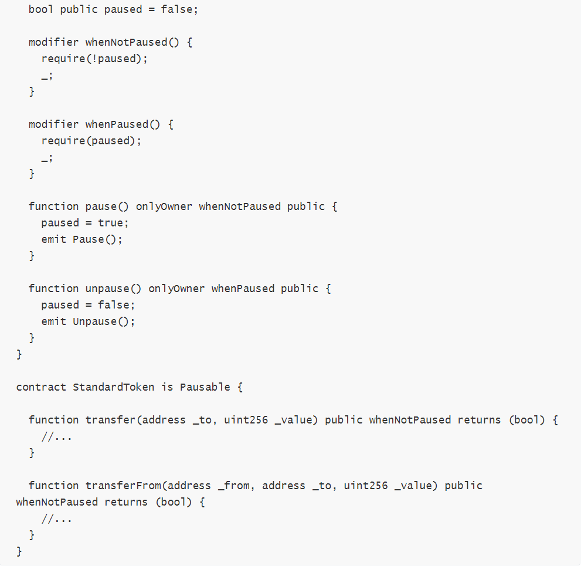
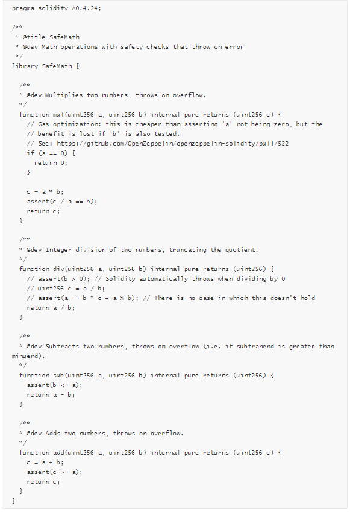
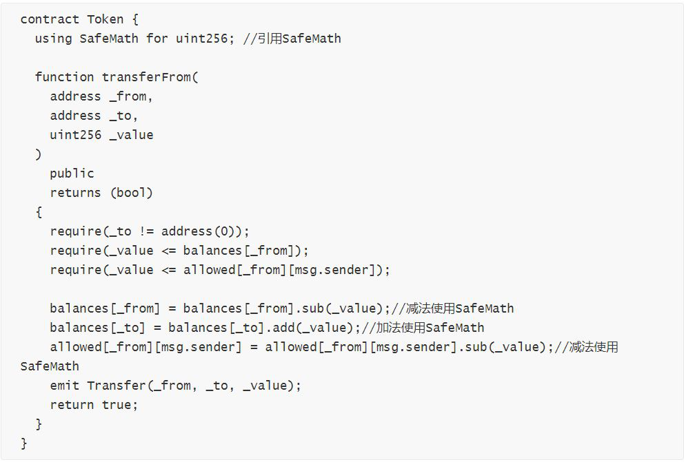

*针对区块链安全问题，成都链安科技团队每一周都将出智能合约安全漏洞解析连载，希望能帮助程序员写出更加安全牢固的合约，防患于未然。*

 

*引子：以戒为基，止观相踵。大矩崇规，链金烹矿。——《头陀赞》 宋·黄庭坚*

 

 **前情提要**

上回说到，可见修饰字斟句酌，函数调用约法三章

 

区块链技术的发展要与安全挂钩，齐头并进，让迅速的发展约束在可靠的范围之内，才能真正让新科技稳步推广，深入人心。在合约开发的过程中，正确精准的添加可见性说明符以及函数修饰符，让相关函数在可控的范围之内最大地发挥效用，是安全开发中控制理念的核心。将细微之处，尤其是敏感和重要函数的调用控制做到最严谨，可以避免许多导致资金流失、权限被盗的安全隐患。

 

**本期话题**

官方标准用心良苦，编写合规不容小觑

 

秋去冬来令又更，萧萧风籁助清吟。

 

我们在以太坊智能合约漏洞分析已经走过了14期，将以太坊自兴起以来发生的大大小小的攻击事件以及漏洞发现进行了归类的分析和讨论。从数据类型到变量，从重要函数到代码逻辑，从代币合约到区块链游戏，安全漏洞不仅仅产生于开发过程中的失误，其源头在一定程度上来源于开发者安全意识的淡薄。同时，这也体现了区块链行业目前的一个痛点，许多开发者在合约编写的过程中并没有注意相应的安全规范，或者并不明确相应的函数和功能实现中官方给出的标准。

 

这期我们针对官方给出的标准协议和编写规范，补充相应的安全检查，旨在将安全在具体的代码层面体现得淋漓尽致。

 

**知识铺垫**

什么是以太坊代币接口标准？

 

ERC，是Ethereum Request for Comments的缩写，字面意思是以太坊注释请求，其本身是一个包含结构化信息的网络文档。ERC标准由以太坊社区定义，目的是制定用户和以太坊交互的规则。这个标准不是一层不变的，社区开发者可以向官方提出自己定义的新标准，但是这个新标准需要被整个以太坊社区接受采纳才能应用在以太坊网络上。从以太坊诞生以来，被采纳并且要求代币遵守的标准出现了几种：ERC-20，ERC-223，ERC-621，ERC-721，ERC-827。在这些标准的建议下，开发者需要对类型、可见性、返回值、事件、变量与函数命名等方面实现与接口的兼容，也就是按照建议去书写代码。从ERC-20启动了区块链代币项目的繁荣开始，之后的标准都是在其基础上进行进一步的补充和完善，便于开发者按照项目需求实现相关的功能。

 

为了实现安全功能的附加代码

自从臭名昭著的The DAO事件发生后，以太坊社区开始重视合约的安全问题，并且许多开发者和研究者想要合力解决和防范类似的攻击事件，于是自发的开始研究代码编写过程中可以调整和完善的地方。于是接踵而来的一次又一次安全事件催生了各种附加安全检查代码，比较著名的是针对BEC事件中整型溢出漏洞出现的SafeMath代码库，开发者可以在编写过程中使用现成的代码来实现安全防护，很好的帮助消除了恶性漏洞带来的影响。

 

**不怕知识不全，就怕视而不见**

这些接口标准和安全代码库都是为了帮助项目方保障项目的长久稳健运行而设计的。可以说，以太坊社区已经并仍在用民主和科学的方式建立一个行业规范。即便如此，仍有很多开发者在编写合约，实现项目功能的过程中，选择坐井观天，对于安全规范的日新月异疏于关注和学习。这样一来，开发出来的合约就缺失相关的安全检查，甚至出现完全与接口不兼容的问题，直接导致的后果就是漏洞被攻击者利用，项目上链就胎死腹中。下面我们就对目前出现的比较重要的编写规范和建议进行分类讨论。

 

**合约编写规范建议**

 

\1. **E****RC****20接口标准检查**

最新的ERC20接口规范如下，建议代币合约开发者按照以下接口规范进行实现，包括类型、可见性、返回值、事件、变量与函数命名等。

 

如果代币合约的开发者未完全按照ERC20标准进行实现，那么将会对去中心化交易所（DEX）和使用ERC20 Token开发的DAPP产生如下影响：

1） transfer、transferFrom、approve函数未声明返回值，：

   \- 合约无法正常完成交易与转账

   \- 部分由合约管理的Token可能永远被锁定在合约中

2） transfer、transferFrom、approve操作未触发Transfer或者Approval事件：

   \- 目前区块链浏览器（eg:etherscan）通过监控事件记录交易，如果该交易未触发事件，区块链浏览器将无法准确记录代币交易

3） name/symbol/decimals使用其他写法，例如全部大写（NAME/SYMBOL/DECIMALS）：

   \- 使用ERC20 标准的DAPP（eg：METAMASK）将无法读取这3个变量的对应值

 

 

\2. **tr****ansfer/transferFrom****执行失败未抛出异常导致假充值**

 

某些交易所确认机制不完善以及相关合约代码未能严格遵循标准而引发的问题，攻击者可实现假充值，情况分析如下：

 

以ERC-20 Token为例，某些交易所可能仅依赖交易状态（TxReceiptStatus）和链上确认次数（Block Confirmation Number）对交易结果作判断，忽略了对Token balance的检查。以下列代码为例：

 

如果发起者账户为0且_value为大于0的某个值，那么调用后函数会返回false，但该笔交易的交易状态是Success:

 

 

有问题的交易所在确认转账状态时，如前所述只读取交易状态和链上确认次数，就会承认该笔转账，导致虚假转账问题的产生。

 

合约代码也存在一定问题，以上述代码为例，按照ERC-20的标准，transfer、transferFrom函数在Token账户转账额度不足的条件下应该抛出异常:

 

 

正确的代码应该是

 

这样交易状态自然会变为Fail。换言之，即便交易所依赖交易状态做最终确认，也可确保自身安然无虞。

 

\3. **目标地址非零检查**

在transfer、transferFrom、transferOwnership

等敏感函数中，用户操作不可逆，所有建议开发者在这些函数实现中增加目标地址非零检查：

 

 

\4. **Pausable模块继承**

建议主合约继承Pausable Ownable ERC20

标准模块，当出现重大异常时可以暂停所有交易

 

 

 

 

 

\5. **以太坊最新安全规范**

Solidity

0.4.22以及以上的编译器版本，构造函数建议声明方式：constructor() public {}

Solidity 0.4.21以及以上的编译器版本，触发事件建议采用：emit Transfer()

 

\6. **对编译器版本的说明**

建议固定编译器版本,即pragma solidity 0.4.8，然后使用对应编译器版本编译发布合约。固定编译器版本有助于确保合约不会被用于最新的可能还有bug未被发现的编译器去部署。智能合约也可能会由他人部署，而pragma标明了合约作者希望使用哪个版本的编译器来部署合约。

 

\7. **弃用项**

 Solidity处于不断的更新迭代中，在此过程存在部分表达式弃用，开发者不应在弃用之后的版本使用它们。

suicide 在0.4.3版本已弃用，使用selfdestruct 替代

callcode在0.4.12版本已弃用

throw在0.4.13版本已弃用，使用revert替代

sha3在0.4.17版本会弹出已弃用警告，使用keccak256 替代

var在0.4.20版本已弃用

msg.gas在0.4.22已弃用，使用gasleft()替代

constant 作为函数状态修饰符在0.4.24已弃用，使用view代替years在0.4.24已 弃用

 

\8. **误用****assert、require、revert、throw**

Solidity官方对assert、require、revert、throw的介绍如下：

Solidity 使用状态恢复异常来处理错误。这种异常将撤消对当前调用（及其所有子调用）中的状态所做的所有更改，并且还向调用者标记错误。 函数 assert 和 require 可用于检查条件并在条件不满足时抛出异常。assert 函数只能用于测试内部错误，并检查非变量。 require 函数用于确认条件有效性，例如输入变量，或合约状态变量是否满足条件，或验证外部合约调用返回的值。 如果使用得当，分析工具可以评估你的合约，并标示出那些会使 assert 失败的条件和函数调用。 正常工作的代码不会导致一个 assert 语句的失败；如果这发生了，那就说明出现了一个需要你修复的 bug。

 

还有另外两种触发异常的方法：revert 函数可以用来标记错误并恢复当前的调用。 revert 调用中包含有关错误的详细信息是可能的，这个消息会被返回给调用者。已经不推荐的关键字 throw 也可以用来替代 revert() （但无法返回错误消息）。

 

在内部， Solidity 对一个 require 式的异常执行回退操作（指令 0xfd ）并执行一个无效操作（指令 0xfe ）来引发 assert 式异常。 在这两种情况下，都会导致 EVM 回退对状态所做的所有更改。回退的原因是不能继续安全地执行，因为没有实现预期的效果。 因为我们想保留交易的原子性，所以最安全的做法是回退所有更改并使整个交易（或至少是调用）不产生效果。 请注意， assert 式异常消耗了所有可用的调用 gas ，而从Metropolis 版本起 require 式的异常不会消耗任何 gas。

适合使用Require的场景：

1） 验证用户输入：require(_to != address(0));

2） 验证外部合约返回值：require(external.send(amount)) ;

3） 验证执行代码的前提条件：require(allowed[_from][msg.sender] >= _value);

4） require应该经常使用

5） require一般位于函数的开头处

适合用assert的场景：

1) 溢出检查：c=a+b;assert(c>=a);

2) 检查常数：assert(this.balance >= totalBalance)

3) 执行操作后验证状态

4) 避免绝对不应该出现的状况

5) assert不应经常使用（触发异常会消耗所有gas）

6) assert一般位于函数结尾处

revert和require类似，可以用于复杂逻辑的场景，throw已弃用。

 

\9. **S****afeMath****使用建议**

为了避免开发人员忽略对溢出的检查，建议使用SafeMath。

下面是OpenZeppelin编写的SafeMath库

 

在合约中使用SafeMath示例

 

 

 

**安全开发 稳步发展**

至此，我们已经完成了对以太坊智能合约重点漏洞分析和修复的整合，总的来说，以太坊作为区块链项目火遍全球的起飞平台，为智能合约概念的实现和区块链技术的普及做出了巨大的贡献。但是安全问题在发展迅速、市场不够冷静的前提下层出不穷，与财产紧密挂钩的以太坊加密货币因为这些问题白白流失，令整个行业人心惶惶。普及安全知识，倡导安全开发与审计，是我们展开漏洞分析连载的初衷。这一期的合约编写规范为以太坊漏洞分析做了一个小结，希望能帮助更多的开发者重视开发的过程中的问题，关注以太坊社区动向，做好项目部署上链前的安全审计，让整个区块链生态进入发展与安全交融的良性循环。

​                        

