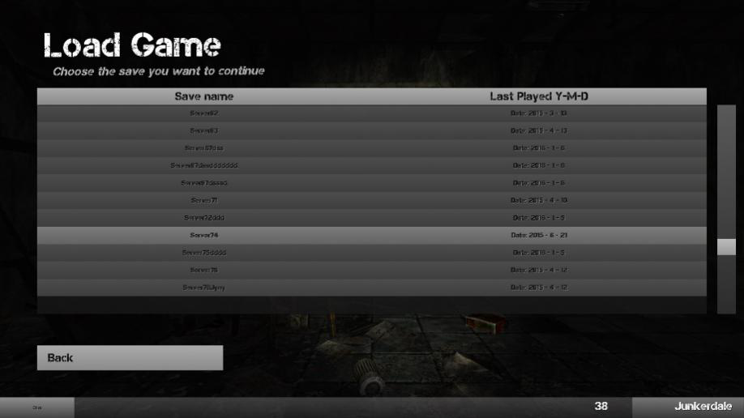
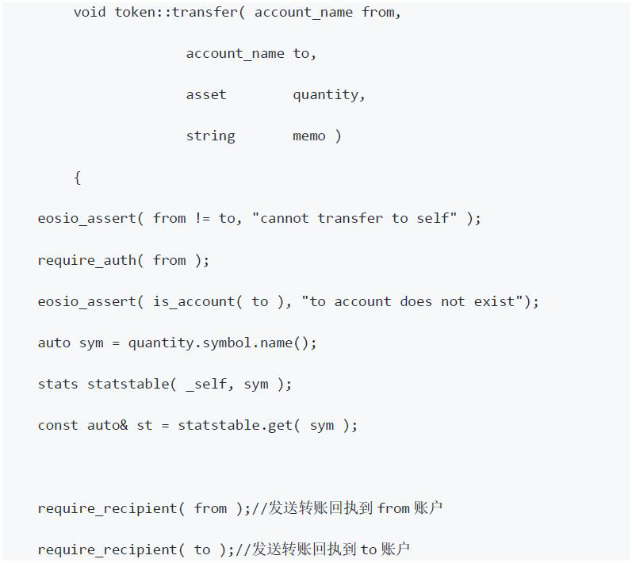
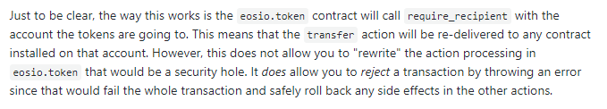
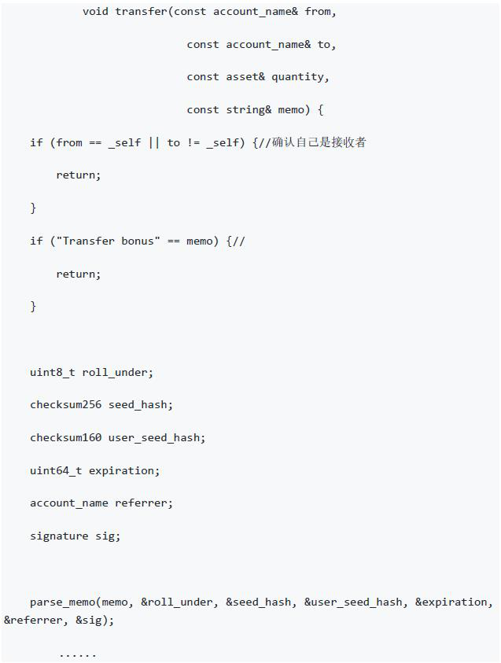
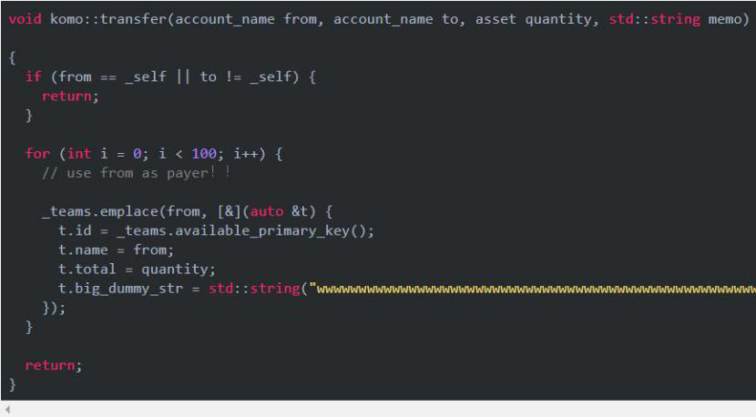

*针对区块链安全问题，Beosin**（**成都链安**）**团队每一周都将出智能合约安全漏洞解析连载，希望能帮助程序员写出更加安全牢固的合约，防患于未然。*

 

*引子：* *千淘万漉虽辛苦，吹尽狂沙始到金 ——* *《浪淘沙》刘禹锡*

 

### **前情提要**

上回书说到，DApp假币鱼目混珠，转账函数检测疏漏马虎

 

对于制造伪EOS以次充好，其实只需要检查发行方是否为eosio，或者调用相关合约查看代币信息，但是检查代币操作依然不够严谨的情况下又会产生更多的变体漏洞，导致遭受变体攻击的风险，所以EOS智能合约中的代码非黑即白，切不可模棱两可。看来，要做到完备的漏洞防御，必须先透彻理解EOS业务逻辑特性以及规则限制。本期我们就由EOS业务逻辑特性为切入点，解析RAM消耗及回滚交易漏洞。

###  

### **本期话题**

陌生转账RAM被吞，交易回滚大奖送人

 

每一位游戏玩家都曾在游戏中体验过一马当先，万夫莫开的畅快淋漓，也体验过心惊胆战，如临大敌的彻骨寒意。但游戏终究是游戏，大多数情况下，都有许多尝试的机会，尤其是单机游戏，可以适时存档后，重新读档不断尝试“从跌倒的地方爬起来”。

 

在EOS游戏和DApp不断涌现的今天，还没有出现与传统单机游戏结合的机制。倒是有很多竞猜类的游戏大受欢迎，但是竞猜类游戏以公平竞猜为游戏理念，不能允许玩家以不断尝试的方式获取奖励。但是不断尝试确实是增加获取奖励几率很有效的方式，于是黑客们找到了一种零成本不断尝试竞猜的方式，试图在EOS DApp中轻而易举拔得头筹。介绍这种攻击手段之前，让我们来了解一下EOS特殊的业务逻辑。

 

### **基础知识**

EOS智能合约业务逻辑特性

 

原理

在EOS智能合约交易情景中，合约常常需要根据收到EOS token的情况来执行相关业务逻辑，这主要是通过eosio.token合约中transfer函数的通知回执来实现的：

 

当用户A向用户B转账时，用户B会接收到这个通知，并可以进行相应的函数处理，这是由require_recipient的特殊机制产生的结果。

 

require_recipient在这里的实现逻辑是: 将原本的action receiver修改为传入的账户，再发起一次action调用，相当于带着同样的参数又调用了一次A和B账户的transfer函数。

 

关于这个特殊的机制，EOS官方给出了相关的解释：

 

 

那么，如果在B账户部署一个智能合约，定义一个transfer函数就可以进行相应的业务逻辑处理，示例如下：

 

注意，这里的transfer函数使用了上一期提到的if (from == _self || to != _self)防御手段，验证收到转账的是自己来预防变体转账攻击。

 

当然，除了transfer，require_recipient(account_name 合约账户XXX)也可以调用XXX合约中的其他同名函数。

 

### **漏洞如影随形**

RAM消耗漏洞

 

按照上面B账户里面的智能合约实现业务逻辑，是没有什么问题的，但是如果按照如下合约实现的话，问题就会出现了：

 

这个智能合约中，komo::transfer中的for循环用账户from的授权写了很多无用的记录到state.db，而这个操作用户在eosio::transfer时是不知情的。

 

有关方面给官方写出了这个情况的修改建议：

 

在require_recipient触发action handler 执行时, 禁止被触发的handler 使用当前action 的授权。  

 

如果被触发的 action handler 有存储要求，可以使用inline actions 来解决， inline action 被执行时就不会用到原来action 的授权了。

 

但是，使用inline action如果不加注意，又会产生另一个漏洞。 

 

 

### **回滚交易漏洞**

 

历史事件

eos.win在2月9日被攻击者利用inline action漏洞的回滚交易攻击通关过，交易细节如下：

 

 

原理：

EOS合约内部的action调用分为inline action和deferred action，用于合约对其他action的调用，这两种调用方式是有一定区别的：

\1. inline action与原来的action是同一个事务，如果inline action失败了，整个事务会回滚；

\2. deferred action 与原来的action不属于同一个事务，并且不保证deferred action 能够成功执行，如果失败了，也不会引起原有action的事务回滚。

 

在早期，很多EOS游戏合约都是使用inline action这种方式来实现的，从下注、开奖、发奖、通知，一系列操作虽然写在不同的action中，但是执行的时候都是通过inline action的方式来联动，达到用户下注后自动开奖发奖的效果。

 

在这种情况下，如果合约通过require_recipient来向用户账户发送开奖通知，那么用户账户就可以通过接收require_recipient的通知来判断是否成功赢取奖励，如果失败，那么调用eos_assert(0)来使action执行失败，由于所有action都是inline action，这将会导致整个transaction失败，用户下注的EOS会退回。 

如果合约没有发送require_recipient通知，攻击者也能通过自己组装inline action，然后通过对自身余额或者合约数据库数据的判断来实现回滚攻击。

 

这样，攻击者制造action执行失败后，就能将每次投注的EOS退回，从而无成本重新加入游戏，直到获奖为止，模拟了单机游戏中“无限读档”，直到通关的游戏方式。

 

 

漏洞修复

在实现自动开奖发奖的一系列动作中，不要惯性思维的使用inline action，适时使用deferred action可以预防整个一套交易流程回滚到下注之前，规避攻击者零成本再次参与游戏的风险。

 

 

###  **黑客尚可锲而不舍，安全怎能松懈怠惰**

 

 

EOS与以太坊相比，以其吞吐量大，处理速度快，以及交易成本低等优势占据了开发DApp的有利地位，与初期的以太坊相比，低级错误导致得安全漏洞发生率似乎有所降低，但是由于游戏以及DApp的业务逻辑性比单纯的数字货币智能合约要复杂许多，黑客依然能够在业务逻辑中找到开发者不曾设想过的“套路”，作为迅速获利的垫脚石。本期的回滚交易攻击说明，即使是攻击者，也想到用不断尝试，不断努力的方式达到自己赢得游戏的目标。作为区块链安全生态的支持者和建设者，我们每一个人更应该以锲而不舍的精神，从底层代码做起，维护区块链相关应用的安全，稳步发展。

 

 

**引用：**

[1]: 警惕！EOS恶意合约可吞噬用户RAM漏洞分析<http://www.cocoachina.com/cms/wap.php?action=article&id=24425
[2]: https://eosflare.io/tx/e28fa9fbd6008edc1a66e01ea4e443265eb9bacce0b423351d178dcb6928de3b

[3]: Inline action to external contract 

<https://developers.eos.io/eosio-home/docs/sending-an-inline-transaction-to-external-contract> 

 