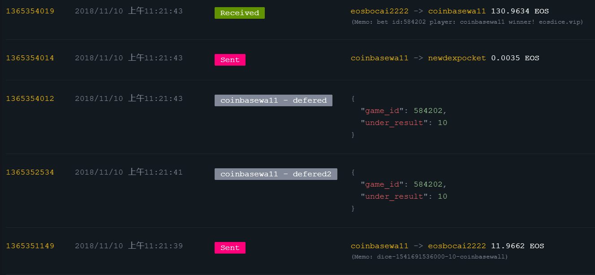
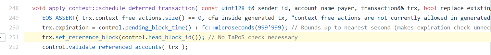
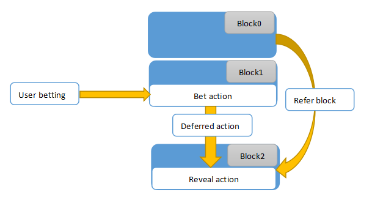
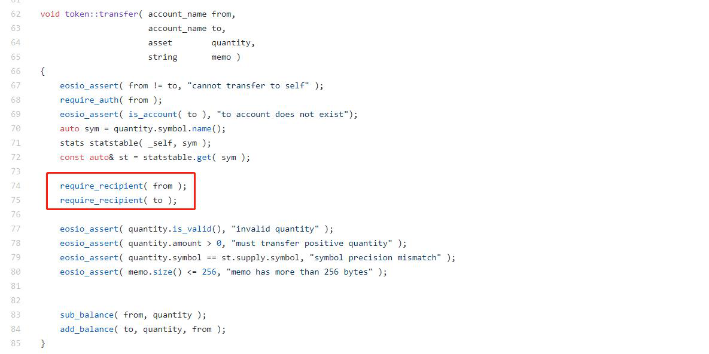
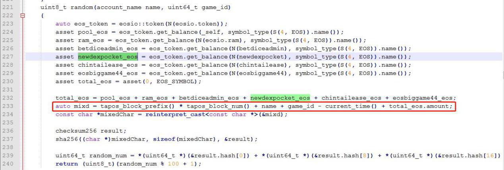
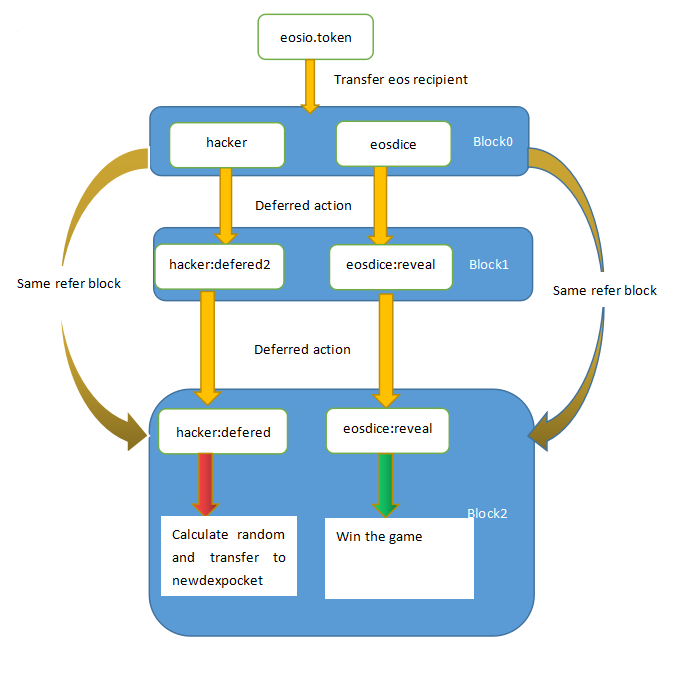

*针对区块链安全问题，**Beosin（**成都链安科技**）**团队每一周都将出智能合约安全漏洞解析连载，希望能帮助程序员写出更加安全牢固的合约，防患于未然。*

 

*引子：“道高一尺，魔高一丈，愈进愈阻，永无止息。”——清·**谭嗣同《仁学》四三*

 

**前情提要**

上回说到，官方标准用心良苦，编写合规不容小觑

 

我们用十五期内容结束了对以太坊智能合约常规漏洞、高危漏洞的分析和总结。纵观整个以太坊安全生态发展历史，有太多的教训和痛楚值得我们铭记。有相关统计，区块链产业导致财产损失的安全事件中有30%是由智能合约漏洞引起的。所以按照以太坊开发语言的使用规范，正确书写每一行合约代码，是保障合约安全的基本要求。倡导上链前的合约审计，确保项目安全启航，是我们对开发者和项目方真诚建议。

 

**本期话题**

EOS游戏屡遭毒手，随机数漏洞屡禁不绝

 

除了以太坊，EOS也是目前比较流行的区块链平台。EOS同样是基于智能合约和区块链搭建而成，而在游戏和DApp领域，由于没有交易费和处理能力强等特性，EOS在技术和设计理念上占有先天的优势。但是，无独有偶，EOS智能合约的安全问题也层出不穷。本期我们就借用最近发生的EOS游戏被攻击事件展开对EOS智能合约漏洞的分析。

 

**攻击事件历史**

EOSDice 第一次被攻击

2018年11月4日 上午3:15开始 EOSDice合约被账户jk2uslllkjfd攻击，攻击者盗取了2500左右EOS并充值入火币。

 

EOSDice第二次被攻击：

11月10日上午11:19开始，coinbasewa11账户再次攻击了EOSDice游戏，盗取4900 EOS转入bitfinex交易所，这个账户对游戏合约进行了95次攻击，攻击过程可以检索到。

 

 

 

**随机数生成问题**

我们在第六期游戏合约漏洞提到过，截止至目前，以太坊和EOS官方均未提供随机数接口，这对游戏开发确实是一个不利的影响，比如抽奖模块的开发。为了实现类似的功能，游戏开发者需要自己编写随机数生成函数，这些函数往往利用区块信息作为参数，然后进行一系列运算，获得一个“随机数”。但是，由于使用区块信息作为参数，这将导致在同一个区块上，使用相同算法的随机数函数将会得到相同的值，攻击者可以利用这点，部署中间合约，然后不停的尝试生成随机数，当生成满意的随机数时，再利用中间合约参与游戏，影响游戏的公平性。我们把这类随机数问题统称为“伪随机数漏洞”。

 

 

**EOS****Dice伪随机数漏洞分析**

由于EOSDice在第一次被攻击后提高了警惕，并且修改了随机数生成的算法，所以我们分两次进行分析。

 

**第一次攻击分析：**

 

由于EOSDice合约开源，我们主要看一下该合约的random函数，该合约抄袭了另一个EOS合约的random函数实现。

 

该随机函数中使用的随机因子主要为：

\1. tapos_block_prefix()  该交易refer区块信息

\2. tapos_block_num() 该交易refer区块信息

\3. name (user账户名)

\4. game_id （自增）

\5. current_time()（当前时间）

\6. pool_ol_eos.amount （合约当前的余额）

 

其随机性主要依赖于refer区块 (refer block) 信息及当前时间、合约余额信息。

在该游戏中，开奖时间是可以根据delay时间推算得到，余额信息在只有一个用户访问时也可以根据计算得到；

 

那么唯一不确定的因子只剩下refer block的信息了。

在实际游戏执行逻辑中开奖的reveal action是由下注的action衍生出来的deferred action，该action的refer block信息并不是由用户指定的，而是由eos链来指定的，代码详见：

[*https://github.com/EOSIO/eos/blob/master/libraries/chain/apply_context.cpp#L251*](#L251) 

 

 

 

 

经过实际测试，deferred action的refer block信息为执行当前action的前一个区块信息，示意如下图：

 

所以，其实开奖时的使用的tapos_block_prefix()其实在下注前就已经产生，那么再结合对时间和余额的预测，就可以提前预测开奖结果；根据交易情况分析，eosdice第一次被攻击很可能就是使用的此种攻击方式。

 

 

**第二次攻击分析：**

 

这里要先介绍一个EOS的小知识：

当EOS转账时，EOSIO.Token会同时通知到from和to账户，但是是先执行对from账户的通知，如下图所示：

 

 

EOS在第一次攻击事件发生后，修改了随机数生成算法，我们来看一下修改后的随机数是否真的随机。随机数计算公式如图所示：

 

 

利用上面提到的转账通知知识，游戏合约收到向自己的转账通知时开始执行下注逻辑，触发deferred action：reveal1，reveal1触发deferred action：reveal进行开奖发奖；那么在开奖（reveal）时取的refer block信息是下注转账action所在的区块信息，不可以预测；

 

但是在EOSDice对随机函数random进行了修改后，这个函数还使用到了账户余额这个随机因子。攻击者可以在转账后自己也接收EOS转账通知，并且自己模拟出跟EOSDice相同的defered action：defered2，然后defered2触发defered action：defered；

 

经此一番操作，此时攻击者的defered 和游戏合约的reveal是处在同一个区块（block）中运行。那么就可以在defered中通过修改随机因子中的余额amount计算random(amount+x)的值，使其满足自己的下注条件。需要注意的是，计算这个值需要进行碰撞试验才能猜准。 

 

攻击者随后向随机因子账户中转入amount为x的eos；那么当运行到reveal开奖的时候，就可以使自己必定中奖。整个攻击流程可以总结为下面这个图：

 

 

加上之前经过对攻击交易分析，可以确定此次攻击者利用的攻击方式是控制随机因子中的余额；

 

 

**漏洞修复**

 

使用与tapos_block_num类似的参数都可能会引发伪随机数漏洞，包括EOS余额和head_block_id，这些参数的特点就是具有一定可控性。

 

如果非要使用tapos_block_preifx作为随机数因子，可以在开奖reveal执行之前多执行一次defered action跳转，保证开奖时获取到的block信息在下注之后生成，这样tapos_block_prefix才是不可预测的。

 

 **伪随机，真漏洞**

 

EOS与以太坊采用了不同的技术和设计理念，比如：

 

1. 以太坊被设计为对于所有可能建立在其基础上的应用中立的平台，而EOS则提供了一些功能例如加密的实现和区块链工具的应用，对应用开发者比较友好。

2. 两者的共识机制不同，相较于以太坊采用的PoW，EOS的DPoS机制类似于董事会机制。

3. 以太坊受到CPU单线程性能限制，其网络交易速度大约只有10次/秒，而且每次交易还需要提供手续费。EOS的并行技术解决了交易速度的问题，并且移除了手续费。

 

EOS的特性，尤其是第三点特性决定了在其基础上的游戏能够满足延迟低，交互流畅的需求，同时能够处理商业级的应用需求。这也是EOS在游戏方面应用较多的原因。但是与以太坊一样，EOS官方并没有提供相应的随机数生成功能。以太坊官方已经推荐用户使用链外的Oraclize库生成随机数。

 

EOS的随机数问题依然是一个令开发者头疼的问题，11月还未结束，EOS DApp已经出现了三次针对随机数的漏洞攻击事件，说明在随机数问题的解决上，亟需一个可靠的解决方案。希望广大DApp开发者在目前没有可靠方案的时候，依靠现有的经验和安全审计，做到将合约内的“伪”随机修复为“真”随机，让EOS DApp有趣、公平、可靠。

 

 

 

引用：

[1]: EOS与以太坊有哪些区别：<https://blog.csdn.net/qq_42204339/article/details/80463686
[2]: 玩EOS上掷骰子的游戏：https://www.jianshu.com/p/b72c71cd3614>

[3] : 游戏skr而止，漏洞周而复始 | 成都链安漏洞分析连载第六期 —— 游戏合约漏洞全面汇总: <https://mp.weixin.qq.com/s/e7m79tk_7jMI_3jlVRMVpQ> 

