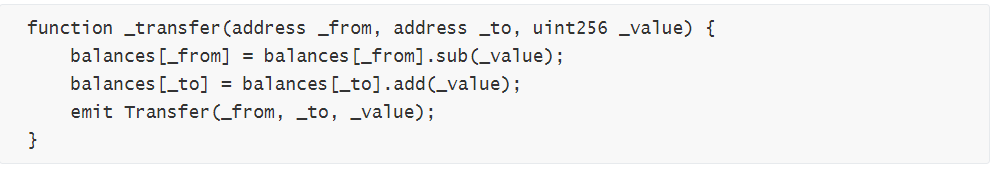
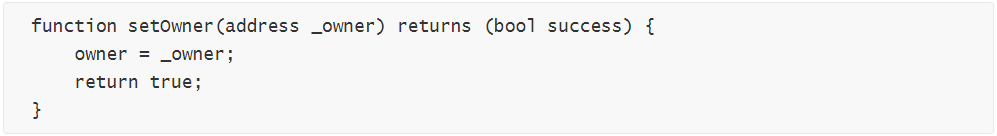
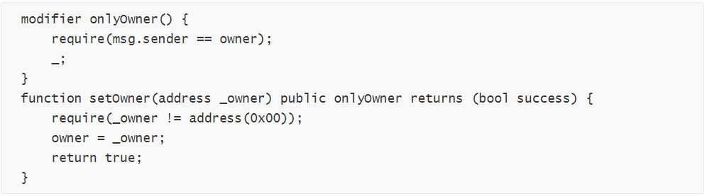

*针对区块链安全问题，**成都**链安科技团队每一周都将出智能合约安全漏洞解析连载，希望能帮助程序员写出更加安全牢固的合约，防患于未然。*

*引子：天下难事，必作于易，天下大事，必作于细 ——* *《道德经·第六十三章》*

 

**前情提要**

上回书，逻辑判断失误事与愿违，功能实现不周弄巧成拙

 

自1995年尼克萨博第一次提出智能合约理念以来，智能合约的功能延展越来越迅速，代码逻辑功能也越来越复杂。在开发的过程中，由于欠缺全局考虑和逻辑测试，非常容易出现逻辑判断和功能实现的不理想，导致合约的正常功能出现异常甚至产生可以被攻击者绕过的逻辑漏洞。审核代码的通篇逻辑或者从历史教训中汲取开发经验成为规避此类漏洞最有效，可行的方案。

 

**本期话题**

可见修饰字斟句酌，函数调用约法三章

自由与限制，两个矛盾又相辅相成的状态。有人言，没有限制的自由不是真正的自由。正如《海上钢琴师》的台词：“钢琴有低音的开头，也有高音的结束，八十八个琴键是有限的，却可挥洒出无限的动人音符，我喜欢这说法，这也是我生存的方式…陆地对我而言就是一艘大船，这世界上有数以千计的街道，而你要如何走到尽头，你要如何选择一个妻子，一栋房子，一幅风景，甚至何种方式死去？这些在我面前就像无穷多琴键的钢琴，但我却一个音符也弹不出来…”当自由挣脱限制的束缚，会让人感到恐惧和迷茫。

自由和限制的关系，也正是科技发展和安全的关系。合约安全的精髓就是限制及控制理念，精确的附加限制条件是防御安全漏洞的有效手段。在函数调用权限的问题上，正确添加函数说明符或者修饰符来控制调用的范围和权限，是协助预防攻击者调用重要和敏感的函数的“保护伞”。

 

 

 **基础知识**

函数可见性说明符（Function Visibility Specifiers）和函数修饰符（Function Modifiers）都可以归纳为修饰函数的成分，为了区分我们分开讲解两个概念：

1. 什么是函数可见性说明符（Function Visibility Specifiers）？

Solidity有两种函数调用方式，一种是内部调用，不会创建一个EVM调用（也叫做消息调用），另一种则是外部调用，会创建EVM调用（会发起消息调用）。Solidity对函数和状态变量提供了四种可见性。分别是external,public,internal,private。其中函数默认是public。

### external

· 声明为external的函数可以从其它合约或通过Transaction进行调用，所以声明为external的函数是合约对外接口的一部分。

· 不能直接进行内部调用。

### public

· 函数默认声明为public。

· public的函数既允许内部调用，也允许外部调用。

· public的函数由于被外部合约访问，是合约对外接口的一部分。

 

### internal

· 在当前的合约或继承的合约中，只允许内部调用。

### private

· 只能在当前合约中被访问（不可在被继承的合约中访问）。

· 即使声明为private，仍能被所有人查看到里面的数据。访问权限只是阻止了其它合约访问函数或修改数据。

由于变量的可见性说明符与函数类似，这个特殊情况也可以造成变量的外部读取，我们在第九期重点解析了这个问题，请移步：<https://mp.weixin.qq.com/s/hP_Cc2CiqFyrnYqK9W_3nQ> 

2. 什么是函数修饰符（Function Modifiers）

修饰符可以用来轻松改变函数的行为，比如在执行的函数之前自动检查条件。他们可继承合约的属性，也可被派生的合约重写。除了官方的一些修饰符，例如，view（函数不会更改和保存任何数据）；pure（函数既不会往区块链写数据，也不从区块链读取数据）之外，我们还有自定义修饰符，用来自定义其对函数的约束逻辑。这些函数可以同时作用于一个函数，例如：

function test() external view oneModifier anotherModifier

######  

 **限制缺失，函数迷失**

从上面的知识我们可以总结，可见性说明符和函数修饰符直接关系到函数可以被谁调用。如果重要和敏感函数缺少相关的修饰成分，就可能沦为攻击者不劳而获的工具。如同各种电影动漫中神秘的力量需要被封印一样，不能正确限制这种力量，势必带来无法挽回的后果。

 

 

##### **函数调用权限漏洞**

 

我们按照可见性说明符和修饰符将漏洞分为两类：

1. 可见性权限漏洞

在基础知识中我们提到，函数默认的可见性为public，允许用户从外部调用它们。可见性说明符的不正确使用可能会导致智能合约中的资金流失：

Ø 错误代码示例

 

函数的默认可见性是public，意味着任何人都可以操作上面的_transfer函数，实现不需要授权就可以转走他人的代币。

 

2. 调用权限不符

部分敏感函数需要onlyOwner权限，如果该函数忘记添加onlyOwner函数修饰器，那么任何人都可以操作该函数，破坏合约执行逻辑。

Ø 错误代码示例

 

setOwner() 函数的作用是修改 owner，通常情况下该函数只有当前 owner 可以调用。 但问题代码中，任何人都可以调用 setOwner() 函数，这就导致了任何人都可以修改合约的 owner。 该问题本质上是函数调用权限不符的漏洞。

Ø 漏洞修复

 

水能载舟，亦能覆舟

实现函数重要功能的环节变为使项目功亏一篑的致命漏洞，这是所有人不愿意看到的。

 

开发过程中准确理解函数执行的安全范畴，在充分理解智能合约知识的基础上加以精确的权限控制，是防止合约函数功能被利用的重要举措。同时，权限的控制需要对合约逻辑的全面理解以及细节掌握。在智能合约开发时，注意细微之处的重要权限相关问题，才能实现合约真正的自由发展。

 

结语：夫祸患常积于忽微,而智勇多困于所溺。

 

引用：

[1]: solidity中的函数修饰符 <https://steemit.com/solidity/@a186r/solidity>

[2]: 函数修改器(Function Modifiers)<http://www.tryblockchain.org/Solidity-FunctionModifiers-%E5%87%BD%E6%95%B0%E4%BF%AE%E6%94%B9%E5%99%A8.html>

[3]: 深入理解Solidity——函数修饰符:<https://blog.csdn.net/qq_33829547/article/details/80378135
[4]: 【Solidity入门系列】函数的可见性与访问权限控制<http://me.tryblockchain.org/solidity-function-advanced1.html

[5]: 可见性或权限控制(Visibility And Accessors)<http://www.tryblockchain.org/Solidity-VisibilityandAccessors-%E5%8F%AF%E8%A7%81%E6%80%A7%E5%92%8C%E8%AE%BF%E9%97%AE%E6%8E%A7%E5%88%B6%E5%99%A8.html>

[6]: CVE-2018-10705 Detail <https://nvd.nist.gov/vuln/detail/CVE-2018-10705>