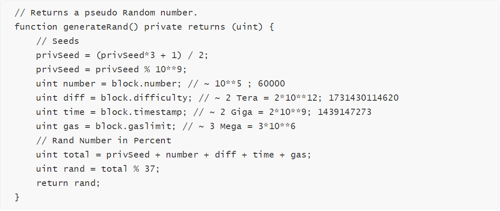

 合约之熵，安全之殇 | 成都链安漏洞分析连载第十期 —— 区块参数依赖

 

*针对区块链安全问题，**成都**链安科技团队每一周都将出智能合约安全漏洞解析连载，希望能帮助程序员写出更加安全牢固的合约，防患于未然。*

 

*引子： 橘生淮南则为橘，生于淮北则为枳，叶徒相似，其实味不同。所以然者何？水土异也。 —— 《晏子春秋·杂下之十》*

 

​                                  **前情提要**

上回说到，合约安全隐私未必，外部读取暴露无遗。

 

只要是储存在storage里面，存在于区块链上的变量，尤其是状态变量，由于区块链公开的特性，都是可以通过不执行合约直接从外部读取的。因此，将隐私信息，不可公开的数据储存在智能合约中是非常不安全的做法。即使进行有意或者无意的此类操作，都要及时附加相应的加密处理，避免因为对于可见性说明符的片面理解而留下安全隐患。全面理解代码技术细节，融会贯通互联网安全知识，才能安全应用区块链技术。

 

​                                   **本期话题**

第十回，机制依赖参数主导，矿工操纵投机取巧

 

山竹过境，气候入秋，想必大家都感受到了久违的一丝凉意，这倒也与区块链产业的“寒冬”有些应景。不过更令人心寒的还是近期以太坊游戏的事故频发。例如，FOMO3D最近的第二次开奖，获奖者仍然是黑客，使用的手段依然是我们在第六期游戏合约漏洞总结当中提到的“类似竞态条件利用的阻塞交易手法”。还有我们之前在快讯中提到的Mycryptochamp这个游戏，其随机数（或者说熵的变量）生成机制依赖的是可预测的参数，导致投机者轻易获取空投，影响游戏公平性。

这些游戏的机制都依据以太坊的特性来设计随机数的产生，但是设计理念却是在没有理解这些特性的基本原理来定制的。因此如火如荼短时间炒作后，在无法实现公平游戏的情况下“迅速降温”。本期，我们将重点分析游戏过于依赖区块参数设计而产生的两种漏洞 —— 时间戳依赖和区块哈希依赖。

 

​                                   **基础小知识**

n 什么是区块参数？

以太坊的实现机制与比特币有很大的差别，以太坊的每个区块头多了一些以太坊自身特殊的字段，用来表示区块的属性值，以太坊智能合约可以通过以太坊提供的接口读取这些属性值：

· block.blockhash(uint blockNumber) returns (bytes32)：指定区块的区块哈希——仅可用于最新的 256 个区块且不包括当前区块；而 blocks 从 0.4.22 版本开始已经不推荐使用，由 blockhash(uint blockNumber) 代替

· block.coinbase (address): 挖出当前区块的矿工地址

· block.difficulty (uint): 当前区块难度

· block.gaslimit (uint): 当前区块 gas 限额

· block.number (uint): 当前区块号

· block.timestamp (uint): 自 unix epoch 起始当前区块以秒计的时间戳

· now (uint): 目前区块时间戳（block.timestamp）

**需要注意的是：在同一个块中，每笔交易读取的区块参数都是一样的**

n 什么是熵？

熵（entropy）的概念最早起源于物理学，用于度量一个热力学系统的无序程度。在信息论里面，熵是对不确定性的测量。

所以在以太坊中，熵（entropy）也就是我们所说的随机性（randomness）。

对于一个以随机性为核心的游戏合约，熵的变量的计算尤为重要。

 

​                             **事故频发，问题凸显**

上面讲到的MyCryptoChamp体现，其合约中RandMod函数使用私有变量randNonce和父块哈希作为参数生成随机数。任何人都可以用web3.eth.getStorageAt()函数外部读取私有变量randNonce（我们在上一期期已经阐述过详细方法），而父块哈希（blockhash(uint blockNumber)）在合约内外都可以读取到。这样产生随机数的计算方法就已经被看破，投机者只需在计算出较理想的随机数时加入游戏即可获得空投。

除此之外，国外已有专业人士Arseny Reutov分析了3649份智能合约，发现有43份存在类似的可被利用的漏洞，并将此类情况称为假随机数生成漏洞（PRNG）。

如此看来，将区块参数与熵联系起来运用到游戏设计（尤其是博弈类游戏）并不是个例。需要思考的是，以太坊的区块参数能不能可靠的运用于熵。

以太坊没有提供类似于传统编程语言的rand()函数。于是实现去中心化的熵已经成为一个颇具规模的问题，许多人参与了这个问题的考究，甚至连V神自己也发表了一片文档提出了一些完善计划，例如使用RanDAO或者私有随机（private randomness）。具体请见这篇文档<https://vitalik.ca/files/randomness.html>。

所以，区块参数能够可靠的用于设计锁仓功能，但是放在随机数生成设计当中，它的地位相当不可靠，形象的来说，同样的橘树，生长在淮南长出甜的橘，生长在淮北长出苦的枳。

 

 

​                         **区块参数依赖漏洞反例**

一、 **时间戳依赖**

数据块时间戳（block.timestamp）历来被用于各种应用，例如随机数的函数，锁定一段时间的资金以及时间相关的各种状态变化的条件语句。矿工有能力稍微调整时间戳，如果在智能合约中使用错误的块时间戳，这可能会证明是相当危险的。

block.timestamp或者别名now可以由矿工操纵，如果他们有这样做的动机。

例如下面这个简单的游戏合约.

 

这份合约表现得像一个简单的彩票。每块一笔交易可以打赌10 ether赢得合约余额的机会。这里的假设是，block.timestamp关于最后两位数字是均匀分布的。如果是这样，那么将有1/15的机会赢得这个彩票。 但是，正如我们所知，矿工可以根据需要调整时间戳。在这种特殊情况下，如果合约中有足够的ether，解决某个区块的矿工将被激励选择一个block.timestamp % 15 == 0或now % 15 == 0的时间戳。在这样做的时候，他们可能会赢得这个合约以及块奖励。由于每个区块只允许一个人下注，所以这也容易受到前置交易攻击。

在实践中，块时间戳是单调递增的，所以矿工不能选择任意块时间戳（它们必须大于其前辈）。但是它们也限制在将来设置不太远的块时间，因为这些块可能会被网络拒绝（节点不会验证其时间戳在未来的块）。

二、 **区块哈希依赖**

在一些赌博游戏合约中，使用区块头相关的参数来产生随机数：区块号(block.number)、区块时间戳(block.timestamp)、区块难度(block.difficulty)、区块gas限制(block.gaslimit)等。当以太坊上矿工挖出一个区块时，此时区块头的相关参数就可以被矿工获知，一些恶意挖矿的矿工可以利用这些区块参数进行攻击。

例如下面这个游戏合约

 

一个实现轮盘赌博的智能合约中，其逻辑是如果下一个块哈希值以偶数结尾，则返回一个黑色数字。一个矿工（或矿池）可以在黑色上下注100万美元。如果他们挖出下一个区块并发现区块哈希值以奇数结尾，他们会丢弃该块、继续挖矿、直到他们挖出一个块哈希值为偶数的块，从而从漏洞合约中获利。

 

**漏洞修复**

随机数生成的方法有很多，并不一定要依赖区块参数，下面介绍两种理念防范矿工或者投机者。

\1. 随机数的来源尽量来自于区块链之外，这可以在具有诸如commit-reveal之类的系统的对等体之间完成。

\2. 通过将信任模型改变为一组参与者（例如在[RandDAO](https://github.com/randao/randao)）来完成。 这也可以通过中心化的实体来完成，该实体充当随机预言。 

\3. 根据Solidity官方建议，合约开发者可以使用链外的第三方服务，比如Oraclize来获取随机数。

总的来说，块变量（一般来说，有一些例外）不应该用于随机种子，因为它们可以被矿工操纵。

 

​                      **问渠哪得清如许？为有****源头****活水来**

这些漏洞，类似事件，惨烈教训，对区块链产业进入寒冬负有不可推卸的责任，从技术角度不断加强对于新知识的正确理解与使用，提高智能合约的安全性是让这个产业冰消雪融，让项目方、参与方合力破冰前行的唯一希望。望各位学而思之、思而践之、践而悟之。

 

 

 

引用：

[1]: Entropy Illusion: 

<https://hackernoon.com/hackpedia-16-solidity-hacks-vulnerabilities-their-fixes-and-real-world-examples-f3210eba5148> 

[2]: Predicting Random Numbers in Ethereum Smart Contracts: <https://blog.positive.com/predicting-random-numbers-in-ethereum-smart-contracts-e5358c6b8620> 

[3]: Validator Ordering and Randomness in PoS: <https://vitalik.ca/files/randomness.html> 

[4]: RANDAO: A DAO working as RNG of Ethereum: <https://github.com/randao/randao> 

[5]: 智能合约随机数算法漏洞影响游戏公平性: <https://mp.weixin.qq.com/s/fnp980bzQjRqNEVuj518lA> 

[6]: 深入理解Solidity:

[https://solidity-cn.readthedocs.io/zh/develop/units-and-global-variables.html#index-2](#index-2) 

[7] : 什么是熵（entropy）？<https://blog.csdn.net/qq_39521554/article/details/80559531> 

 